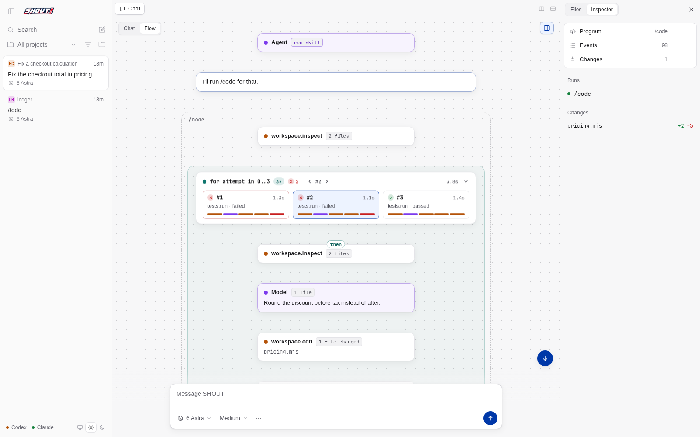

<p align="center">
  
</p>

SHOUT explores a unified agent harness and programming runtime, building on the earlier JOSH/ALLEN research.

## SHOUT, the coding agent

SHOUT is a local coding agent that runs as a desktop app and serves the same UI to browsers on your LAN and Tailscale. You add project folders, talk to an agent in threads, and approve every file change and command it proposes. Deterministic work (reading, searching, looping, applying edits, running tests) runs as ALLEN programs in the JOSH VM; the model is asked only for typed judgments, and an answer of the wrong type is asked for again. The Flow view and Program tab show what each program did and on which source lines.

```sh
npm run setup      # dependencies, the pinned JOSH/ALLEN build with SHOUT's patches
npm run desktop    # the desktop app; it attaches to a running server or starts its own
npm start          # or only the server: open a printed LAN or Tailscale URL in any browser
```

The server listens on port 4310 on all interfaces, accepts only this machine's own names and addresses (plus any in `SHOUT_ALLOWED_HOSTS`), and has no login: anyone who can reach the port can use it. Set `SHOUT_HOST=127.0.0.1` for local-only.

- **Providers and models.** Codex (Codex CLI **0.157.1**, `codex login`): 6 Astra and 6 Sol. Claude (Claude Code through the Claude Agent SDK, `claude auth login`): Fable 5.1 and Opus 5.5. Effort is adjustable; the model is locked once a thread's first message is sent. Each provider sees only SHOUT's instructions and tools, not your own config, rules or MCP servers; Claude Code still adds your account email and the date, which cannot be turned off.
- **Projects and threads.** A project is a folder with a test command and a default model. The sidebar lists threads across projects with their status (Working, Approval, Input, Failed, Done); the three sample scenarios start from the welcome screen.
- **Skills.** Repeatable workflows written in ALLEN and run as slash commands: `/code`, `/review`, `/explain`, `/commit`, `/find`, `/todo`, `/test`, and `/new-skill <what it should do>` to write, compile-check and save a new one. The agent can also write and run its own ALLEN programs. See the [skill authoring guide](apps/shout/skills/GUIDE.md).
- **Flow.** A second mode of the chat pane that draws each run as cards following the program's structure: loops as groups or stacks, branches as chips, parallel tasks as tracks. The Program tab counts effects on the exact source lines that ran.
- **Sub-agents.** The agent can fan out up to 8 read-only sub-agents at once; each gets its own tab.
- **Another computer.** `npm run desktop:package` builds a small desktop client that connects to this machine's server over the LAN or Tailscale (Node 22.12+ on the other computer).



Full usage, architecture, HTTP API, limits and the security model: **[SHOUT app](apps/shout/README.md)**. The desktop shell, remote mode and platform notes: **[desktop app](apps/desktop/README.md)**. How SHOUT drives JOSH/ALLEN, today's runtime patches and what remains awkward: **[JOSH/ALLEN integration](docs/JOSH-ALLEN-INTEGRATION.md)**.

```sh
export JOSH_BIN="$(bash tools/setup-josh.sh)"
npm run verify        # syntax checks, 55 prototype tests, 4 interactive CLI scenarios, 206 app tests
npm run test:browser  # the real UI in Chromium, with a scripted agent and judgments
npm run test:desktop  # the Electron shell, including remote mode and the client bundle
npm run claude:smoke  # live: a Claude judgment, a resumed two-turn thread and ALLEN programs with re-asks (costs a little)
```

Browser tests use `/usr/bin/chromium`, `CHROMIUM_BIN`, or Playwright's Chromium (`npx playwright install chromium`). Verification records: [GUI verification](docs/GUI-VERIFICATION.md).

## Original harness prototypes

Two working prototypes explore the same principle: deterministic code handles orchestration; models make judgments. Both run the pinned JOSH/ALLEN revision with SHOUT's patches applied (protocol `josh/1.8`).

| Prototype | What owns the conversation | Start here |
|---|---|---|
| Native adapter | Existing Codex app-server harness; ALLEN is a native dynamic tool | [Native README](prototypes/native/README.md) |
| Owned harness | Our session, command router and execution kernel; bounded Codex workers supply judgments | [Owned README](prototypes/owned/README.md) |

Both completed actual model-backed runs. Their suites now have 55 automated tests (15 native, 40 owned) plus four interactive scenarios. The owned harness's kernel is what the SHOUT app runs programs with. See [implementation findings and comparison](docs/IMPLEMENTATION-FINDINGS.md) and [verification evidence](docs/PROTOTYPE-VERIFICATION.md).

## Try them

Requirements: Linux with Bash, Git, Rust and Cargo (through rustup, the build uses the toolchain the runtime pins), and Node 22+ with npm. Setup clones the pinned upstream runtime, applies SHOUT's patches and builds it, and installs npm dependencies. Live runs need a signed-in Codex CLI of the exact version each checks: **0.153.3** for the native adapter, **0.157.1** for the owned harness (select it with `CODEX_BIN`). Offline runs need no model credentials.

```sh
git clone https://github.com/mcreenan/shout.git
cd shout
npm run setup
npm run verify

# Real ALLEN, deterministic model decisions and labelled scripted answers:
npm run native:demo
npm run owned:demo

# Actual model decisions; labelled scripted answers:
npm run native:live
npm run owned:live
```

For interactive native usage, run `npm run native`, then enter `/live` (actual model) or `/run` (fixture model). Copy the displayed question ID into `/answer QUESTION_ID true`. Use `/status`, `/cancel`, and `/quit` while it runs. The native prototype permits one execution per process.

For interactive owned usage, run `npm run owned`, then say `Please triage the synthetic tickets` or enter `/review`. Answer with `/answer QUESTION_ID {"accept":true}`. Ordinary chat can select the registered workflow or reply. `/status`, `/cancel`, `/trace`, and `/quit` are available. Use `npm run owned -- --fixture` for offline interaction.

These are terminal prototypes with visible JSON event traces. The native tool can accept ALLEN source and input; the owned harness supports `/run file.allen [input.json]`. Both use independent `model.request` judgments, not same-agent `agent.ask`. Neither resumes after a process restart. The track READMEs describe capability and schema limits.

## Original proposal

The research below preceded implementation. Its proposed features and estimates are not a claim that all of them now exist.

- [Read the detailed proposal](docs/unified-agent-runtime-proposal.md)
- [Open the browser edition](docs/unified-agent-runtime-proposal.html) — rendered diagrams, navigation, and print styling; no network required
- [Printable PDF](docs/unified-agent-runtime-proposal.pdf)
- [JOSH/ALLEN source audit](docs/research/josh-allen-audit.md)
- [Harness and protocol research](docs/research/harness-protocols.md)
- [Durable runtime precedents](docs/research/runtime-precedents.md)
- [Sub-agents implementation plan](docs/proposals/subagents/IMPLEMENTATION-PLAN.md) (implemented 2026-09-27)

Research date: 23 September 2026. JOSH/ALLEN source pinned to [`abb8a978`](https://github.com/mcreenan/josh-allen/tree/abb8a9782fc438d1b87e8aa2fdaea65e5db633c3); SHOUT now applies [nine local patches](tools/josh-patches/README.md) on top of that revision. The report distinguishes existing capabilities, proposed behavior, estimates, and untested hypotheses.

The main report includes architecture and lifecycle diagrams, four practical scenarios, a recovery trace, alternatives, obstacles, estimated effort, and explicit continue/pivot criteria. Supporting notes contain primary-source citations and the scope of verification.

Implementation was delegated into `.worktrees/native` (`prototype/native-adapter`) and `.worktrees/owned` (`prototype/owned-harness`), with independent helper audits. Both implementations are integrated under `prototypes/` on `main`; the worktrees remain available. [Work order](docs/PROTOTYPE-WORK-ORDER.md) · [Completion checklist](docs/PROTOTYPE-PROGRESS.md).
