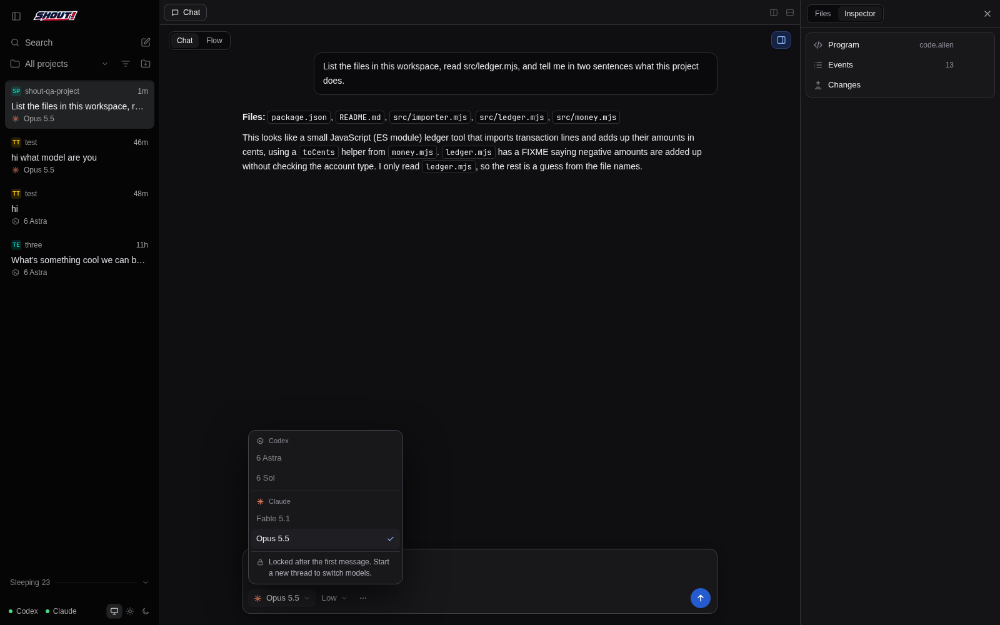
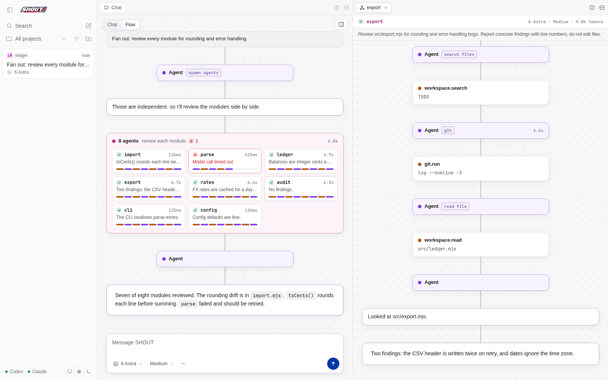
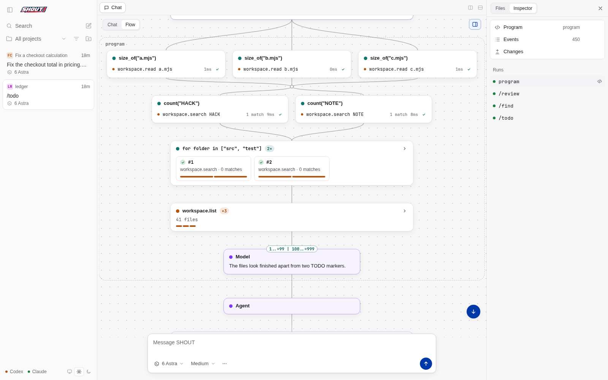
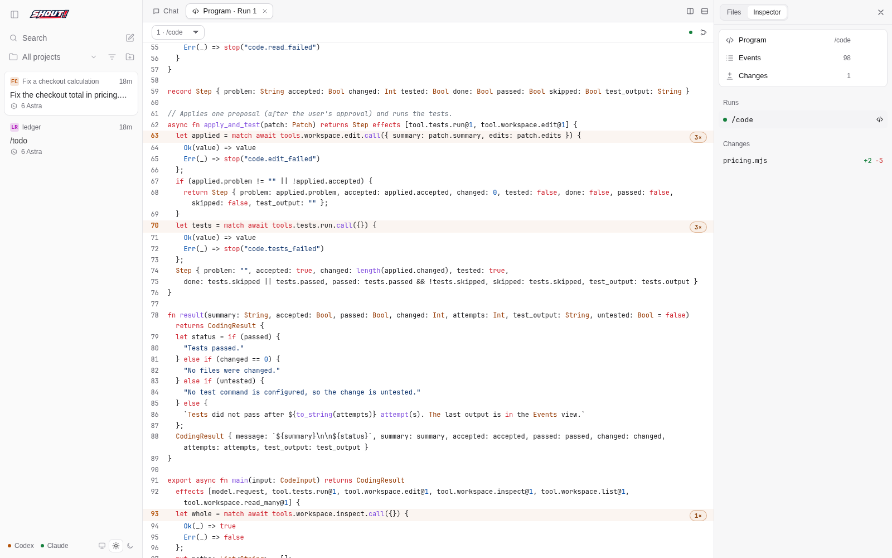

# SHOUT coding workspace

SHOUT is a local coding agent. A Node server owns your projects and threads, runs one agent thread per conversation on Codex or Claude, and executes multi-step work as ALLEN programs in the JOSH VM. The same UI runs in the SHOUT desktop app ([`apps/desktop`](../desktop/README.md)) and in any browser that can reach the server on your LAN or Tailscale. This app grew out of the owned-harness prototype; the original prototypes remain independently runnable.

## Start

From the repository root:

```sh
npm run setup      # dependencies, the pinned JOSH/ALLEN build with SHOUT's patches, the skill checker
npm run desktop    # the desktop app: attaches to a running server or starts its own
npm start          # the server alone; open a printed URL in a browser
```

Requirements: Linux (macOS paths exist but are untested), Node 22+ (22.12+ for the desktop app), Bash, Git, Rust and Cargo for the runtime build (through rustup, the build uses the toolchain the runtime pins), and at least one model provider:

| Provider | What SHOUT needs | Sign in |
|---|---|---|
| Codex | Codex CLI **0.157.1** exactly (set `CODEX_BIN` if the `codex` on your PATH is another version) | `codex login` |
| Claude | The Claude Code build pinned by `@anthropic-ai/claude-agent-sdk` 0.3.283 (Claude Code 2.1.283), installed by `npm run setup`; or `CLAUDE_BIN` | `claude auth login` |

The server checks both providers once, at start. The sidebar footer shows a dot per provider; hover or click an unavailable one to read why. After signing in, restart the server. `npm start` also installs missing runtime dependencies and builds JOSH if needed.

The server listens on `0.0.0.0:4310` so other devices on your LAN or tailnet can use it. It accepts only this machine's detected names and addresses (interfaces, `localhost`, the host name, `<host>.local`, and the Tailscale DNS name when `tailscale status` works) plus `SHOUT_ALLOWED_HOSTS`, and prints the URLs it accepts. Open the port in your firewall for the LAN subnet or Tailscale interface if needed. See [Security and trust](#security-and-trust) before exposing it.

`npm start` reads the repository's ignored `.env` (copy `.env.example`). Explicit environment variables win over `.env`.

| Variable | Default | Effect |
|---|---|---|
| `PORT` | `4310` | Server port |
| `SHOUT_HOST` | `0.0.0.0` | Bind address; `127.0.0.1` for local-only |
| `SHOUT_ALLOWED_HOSTS` | none | Extra exact host names or IPs, comma-separated (no wildcards) |
| `SHOUT_STATE_DIR` | `.runs/shout` | Threads, projects, sample copies, run scratch |
| `SHOUT_WORKSPACE` | current directory | Folder for API clients that create a thread without naming a project |
| `SHOUT_WATCH` | unset | `1` restarts the server when its source changes |
| `SHOUT_HOME` | `$XDG_CONFIG_HOME/shout` or `~/.config/shout` | User skill folder is `<this>/skills` |
| `CODEX_BIN` | `codex` | Codex CLI 0.157.1 executable |
| `CODEX_HOME` | `~/.codex` | Where SHOUT finds the Codex login (`auth.json`) to link |
| `CLAUDE_BIN` | the SDK's bundled Claude Code | Claude Code executable |
| `JOSH_BIN` | `.cache/josh-allen/target/debug/josh` | JOSH binary |
| `SHOUT_ALLEN_CHECK` | `shout-allen-check` next to `JOSH_BIN` | Skill checker binary |
| `JOSH_CACHE_DIR` | `.cache/josh-allen` | Where `tools/setup-josh.sh` clones and builds |
| `CHROMIUM_BIN` | `/usr/bin/chromium` | Browser for `npm run test:browser` |

The desktop app adds `SHOUT_SERVER_URL`, `SHOUT_ELECTRON_FLAGS` and `SHOUT_DESKTOP_TITLEBAR`; see the [desktop README](../desktop/README.md).

State lives under `SHOUT_STATE_DIR`, ignored by Git: `sessions/<id>.json` (one file per thread), `projects.json`, `workspaces/` (sample copies), `codex-home/` (SHOUT's own Codex home), `runs/` (run scratch) and `shout-tool-catalog.json`.

## Projects and threads

A project is a folder on the server's computer; a thread is one conversation in a project. The UI says "thread"; the API and code say "session".

- **Add project** opens the native folder chooser in the desktop app, and a folder browser on the server's file system in a browser or a remote desktop client. A folder that does not exist can be created. A new project opens with a new thread; adding a folder that already has a project opens its latest thread.
- **Project settings** (project context menu): name, test command and default model. The test command is yours, never the model's. An idle thread picks up a changed test command at once; a busy one with its next message. The default model applies to new threads while its provider is available.
- **New thread** (the compose button, `Ctrl/⌘+N`, or `N` when not typing) starts a thread in the scoped project, else the open thread's project, else the most recently active one (your own projects before samples). A project's empty, idle thread is reused rather than duplicated.
- **Samples**: with no thread open, the welcome screen shows Add project, New thread and the three sample scenarios. Choosing a sample copies it into `workspaces/` as a new sample project and fills the composer with its prompt.
- **Removing a project** deletes its threads' histories. Its folder is never touched, except a sample's scratch copy, which is deleted.
- A thread whose folder has gone is kept as read-only history, marked "Folder missing".

The sidebar follows T3 Code's layout: search, the project scope picker, View options (single list or **Group by project**; sort by recent activity or creation) and Add project at the top; thread cards below (project monogram and name, a status or age, the title and the model); sleeping and folder-missing threads on a collapsible **Sleeping** shelf. Statuses are Working, Approval, Input, Failed and Done (a finished thread you haven't opened since). Double-click a title or press `F2` to rename; right-click for Rename, Sleep/Wake, Copy path, Copy thread ID, Reveal in file manager (local desktop app only), Project settings and Delete. Drag the edge to resize (208 px minimum, 256 px default); `Ctrl/⌘+B` collapses it, `Ctrl/⌘+1`…`9` opens a thread, `Ctrl/⌘+Shift+[` / `]` steps through threads. The footer holds the providers (a label and a status dot each; only the dots when the sidebar is at its narrowest) and the System/Light/Dark theme switch. A new thread, a deletion or an Add project that is slow to finish never takes you away from a thread you opened in the meantime.

## Models

| Model | Provider | Model ID | Efforts |
|---|---|---|---|
| 6 Astra (default) | Codex | `gpt-6-astra` | low, medium, high, xhigh |
| 6 Sol | Codex | `gpt-6-sol` | low, medium, high, xhigh |
| Fable 5.1 | Claude | `claude-fable-5-1` | low, medium, high, xhigh, max |
| Opus 5.5 | Claude | `claude-opus-5-5` | low, medium, high, xhigh, max |

New threads start on 6 Astra at medium effort, or on the first model whose provider is available. The model is **locked when the thread's first message is sent**: the agent thread lives in one provider. The picker then shows the other models disabled with "Locked after the first message. Start a new thread to switch models." Effort can still change while the thread is idle; it applies from the next message, to the agent's turn and to that task's ALLEN judgments.



### What each provider sees

Both providers get SHOUT's instructions, the thread context (workspace path, test command, skill list) and SHOUT's tools, nothing else of yours.

- **Codex**: one `codex app-server` process serves every Codex thread. It runs with its own `CODEX_HOME` under the state directory, with an empty config; only your login is shared, through a symlink to `auth.json`. Codex's shell, patching, web search, apps, plugins, multi-agent, browser and computer use, image, hooks, code mode, goals and memory features are disabled, and `AGENTS.md` is not read. Codex still adds its own environment context (such as the working directory and the sandbox settings of its disabled tools); SHOUT's instructions tell the model that those settings do not limit SHOUT's tools.
- **Claude**: each thread is one Claude Code session through the Claude Agent SDK. The thread ID is the Claude session ID; the session is created on the first turn and resumed on later turns and after restarts. Each turn is one SDK query, so one Claude Code process per turn. Claude Code's built-in tools are off, and no user or project settings, `CLAUDE.md`/`AGENTS.md`, memory, hooks, plugins, skills or MCP servers are loaded; any tool other than SHOUT's is refused. A flagged request ends in a refusal instead of switching model. **What cannot be turned off:** Claude Code still adds its environment block and a reminder containing your signed-in account email and the date. Transcripts are saved by Claude Code under `~/.claude/projects/<encoded workspace path>/` (or under `$CLAUDE_CONFIG_DIR`), titled "SHOUT".

ALLEN `model.request` judgments use a separate, tool-less, stateless call per attempt: `codex exec --ephemeral --ignore-user-config` in a temporary folder with an output schema, or one unsaved Claude Code query with structured output. Any ALLEN type can be asked for. JOSH checks every answer against the type; one that does not match is asked for again, with the reasons added to the worker's instructions, up to the prompt's `max_attempts` (3 unless the program sets fewer). After the last attempt the program gets `Err` (`model.validation_failed`); a refusal (Claude reports these) also reaches it as `Err` (`model.denied`). A worker that fails or times out, or an exhausted judgment budget, fails the run.

## Use a coding thread

A message that starts with `/name` runs that skill directly, with no model call to route it. Anything else is one turn of the thread's agent. SHOUT's instructions and the thread context go in once, when the thread starts; later messages are sent as typed, and the provider keeps the history. The agent replies in Markdown and acts only through these tools:

| Tool | What it does | Approval |
|---|---|---|
| `list_files`, `read_file`, `search_files`, `git` | Read the workspace directly (`git` is limited to read-only subcommands) | none |
| `list_skills` | The skills that compile | none |
| `allen_guide` | The [authoring guide](skills/GUIDE.md), the generated tool catalog and two example programs | none |
| `run_skill` | Runs a skill, as if you typed `/name args` | inside the skill |
| `run_program` | Compiles an ALLEN program the agent wrote and runs it like a skill; compile errors go back to the agent as diagnostics | inside the program |
| `spawn_agents` | Runs read-only sub-agents in parallel and returns their reports | none (children only read) |

Changing anything (editing files, running tests or commands, multi-step workflows) happens in an ALLEN program: a built-in or workspace skill, or one the agent writes. The program's control flow runs in the VM; it calls host tools and asks the model only for typed judgments. Every `workspace.edit`, `workspace.write` and `shell.run` stops at an approval card: a title, for commands the exact command and "Runs with your user permissions.", a two-line summary (click for more), one chip per file with its diffstat (click to open Changes at that file), then **Approve** or **Decline**. A declined change is final for that proposal; the agent is told not to work around it. Your answer shows in the chat as an Approved, Declined or Answered chip.

When a program asks you something (`user.ask`), the question shows a form built from the answer type: text boxes, checkboxes, whole-number and number fields, a choice for an enum, a variant picker with the chosen variant's fields for enums with payloads and `Result`, an optional field for `Option`, rows for lists and maps, positional fields for tuples. Only a type none of these fit falls back to a JSON text box. The form checks the answer before sending it and marks what is wrong in place. If the runtime still asks again, the form keeps your previous answer and marks the fields it rejected.

Within one turn the agent's programs (`run_skill`, `run_program`) run one at a time, in the order it called them; reads and `spawn_agents` run beside them, and a pending approval or question stays answerable while they finish. If a turn ends or fails while one of its programs is still running, that program is cancelled before the thread settles.

`/code` reads the whole workspace when it is small; otherwise one judgment picks up to 12 relevant files from the listing. It asks for snippet edits (an exact `find` text that must occur once, and its replacement), and SHOUT turns them into full before/after changes for approval. If tests fail or an edit's `find` doesn't match, it feeds the problem back for up to two repairs; each proposal needs its own approval. `/test` runs the project's test command through ALLEN with no model call; an empty test command is reported as skipped, never as passing.

The composer's ⋯ menu has **No time limits** (turns off the per-judgment, per-run and per-sub-agent time limits for this thread; only while idle) and **Export session**. **Cancel run** (the stop button) stops model, VM, sub-agent and test work; it is not a rollback, and files already written stay. A message sent right after a cancel waits up to 10 seconds for the provider to confirm that the old turn stopped, then runs on the same thread; if the old turn has not stopped by then, the new turn ends with "The previous turn is still stopping; try again shortly". Sending clears the composer at once, and the text comes back if the send fails. Each thread keeps its own unsent draft, and so does the welcome screen. A message sent from the welcome screen first creates a thread; if you open another thread before it exists, nothing is sent and the text becomes that thread's draft. Reloading the page reconnects to the running task. Restarting the server restores threads and agent history, but marks unfinished tasks and sub-agents interrupted and invalidates their questions; a suspended VM does not resume.

## Sub-agents

`spawn_agents` takes a purpose and up to 8 agents, each a short name and a self-contained brief. Each child is a fresh thread on the parent's own provider and model, with only `list_files`, `read_file`, `search_files` and `git`, its own instructions and nothing from the parent's conversation. Children cannot write, run skills, ask you anything or spawn further agents. The call returns every child's final report (or error) to the parent; one child failing does not fail the others.

Limits: 8 agents per call, 4 running at once across the thread (the rest queue), 24 per thread, 40 tool calls and 10 minutes per child. Cancelling the task, or the parent's turn ending, stops every child. Child steps are kept on the agent record (`session.agents[]`, at most 400 events each), not in the thread's event log; the parent's log records the fan-out as a `tool.started`/`tool.completed` pair with `tool: 'agents.spawn'`.

In Flow mode a fan-out is one fleet card with a tile per agent (state, latest step or report line, timer, a strip of recent steps; a running agent's current step pulses). Clicking a tile opens that agent in a tab beside the chat, or focuses its tab. A sub-agent tab is Flow only: a header with name, state, model and tokens, the brief on one line, and the agent's own canvas; no composer.



On Codex all children share the one app-server process. On Claude each child is its own Claude Code process (about 250 MB each in the live check).

## Skills

A skill is a repeatable workflow written as one ALLEN file and run as a slash command: `/name arguments`. Type `/` for a menu of skills with scope, argument hint and description; `/skills` lists them and `/help` explains commands. The agent also sees each skill's description and can run one when your request matches.

| Command | What it does | Model calls |
|---|---|---|
| `/find <text>` | Literal search, grouped by file | none |
| `/todo` | TODO/FIXME/HACK markers, counted per file | none |
| `/test` | Runs the project's test command | none |
| `/review [focus]` | Reviews the uncommitted diff and new files in batches; findings sorted by severity. A change too large for one diff is fetched file by file, up to 100 files; the rest are listed as not reviewed | 1 per batch, at most 12 |
| `/explain <path or question>` | Explains a file, or picks up to 8 relevant files and answers | 1–2 |
| `/commit [hint]` | Drafts a conventional commit message, lets you edit or confirm it, then runs `git commit` after approval | 1 |
| `/code <goal>` | Selects files, proposes snippet edits for approval, runs tests and repairs | several |
| `/new-skill <description>` | Writes a new skill, compile-checks it with up to 3 repairs and saves it after approval | 1–4 |

A judgment that is asked again counts as another model call. Skills are discovered in `<workspace>/.shout/skills/`, then `<SHOUT_HOME>/skills/` (default `~/.config/shout/skills/`), then the built-ins in [`skills/`](skills/). Earlier scopes hide later ones with the same name. The file name is the command (`[a-z][a-z0-9-]*`, at most 40 characters). The leading `//` comment lines are the header: the first line is the description, and an `// args: <hint>` line gives the argument hint. Skills are recompiled on every use, and `/skills` marks any that don't compile.

Writes and shell commands always go through a host approval, whatever the skill does. [`skills/GUIDE.md`](skills/GUIDE.md) is the authoring guide; the agent gets the same guide from `allen_guide`, and `/new-skill` gives it to the model with the generated tool catalog. To run a skill from the command line: `node tools/run-skill.mjs --workspace DIR [--approve|--decline] [--model ID] [--effort LEVEL] -- "/name args"`.

## Samples

Choose a sample on the welcome screen and send the prefilled prompt. Each choice makes a fresh copy of the template; the templates in this repository never change.

| Sample | What to observe | Success condition |
|---|---|---|
| Fix a checkout calculation | Discount applied before tax; one approved file edit | Four checkout tests pass |
| Implement a missing slug utility | A missing function supplied from the contract tests | Five slug tests pass |
| Unify inconsistent validation | Signup and profile share one rule | Five validator tests pass |

Send `/test` first to see the failures. Decline the patch or cancel while approval is pending to exercise the other branches. Model output varies; judge by the recorded test results. See [scenario definitions](scenarios/README.md).

## Chat, Flow and the side panel

The thread's main tab has two modes, **Chat** and **Flow**, with the composer underneath both.

**Chat** shows the conversation. Replies render Markdown (headings, lists, task lists, quotes, tables, highlighted code, links) built as DOM nodes, so model output cannot inject HTML. A link to a workspace path such as `[pricing](src/pricing.mjs#L12)` opens that file beside the chat. Each program run is one compact row: skill or program name, a status dot, and its latest steps; expand it for every step, or open its program or its Flow. A run that fails inside its program (a runtime trap, or a budget or provider failure at an effect) says where: "failed at line N" on the row and a **line N** link under the failure message open the Program tab on that line. A program the agent wrote gets the failing line quoted back, so it can fix it. A skill's name on the row opens the skill's tab: its description, arguments, capabilities, tools and source with any compile errors, and **Use**, which puts `/name` in the composer without running it. Times show on hover.

**Flow** draws the thread as top-to-bottom phases of cards on a pannable canvas. Each card has a kind dot, a title, an outcome icon, one result line and a timer. A run sits in a frame named for its skill. With the effect-origin data from JOSH, a run's steps follow the program's own structure:

- a loop whose iterations take several steps is a **group card** with one tile per iteration; one iteration opens in a frame below it (the live one while it runs), and the arrows step through iterations;
- a loop that takes one step per iteration is a **stack card**, such as `git.run ×40`, with a strip of results; expand it for one row per step;
- the `if` branch or `match` arm that led to a step is a **chip** on the card's top edge (`then`, `else`, or the arm's pattern); hover for the condition as written;
- tasks running in parallel in an `await` block are side-by-side **tracks**, named by the function each runs;
- a `spawn_agents` fan-out is a **fleet card**.

A judgment or question the runtime asked for again stays one card, with an `attempt 2` chip while it runs and `2 attempts` after. A judgment whose every attempt was rejected reads as failed, with the reason, rather than showing its last answer. Steps cut off by a cancel or a restart keep a dashed, faded look.

Programs without origin data fall back to grouping by kind (reads, judgment, actions). The canvas follows the newest card; drag or scroll to look around (`Ctrl`+scroll zooms), and the Follow button resumes. `Tab` moves through cards in reading order, `Enter` or `Space` selects, `Escape` clears.




Selecting a card opens its **step detail** in the side panel: the scope breadcrumb (calls, loop iterations, branches and the conditions behind them), a link to the exact source line, the inputs and outputs (arguments, files, matches, output, diagnostics, a judgment's prompt and answer), every attempt of a request that was asked again (its duration, each rejection as the field's path and a short reason, and the rejected answer), and the raw events, each of which opens in the Events view.

**Tabs and splits.** Program, Events, Changes, skill, file and sub-agent tabs open beside the chat. Use a tab strip's split buttons, or drag a tab, file or view launcher onto a tab strip or a pane edge; drag dividers to resize; middle-click or × closes. The chat tab can move but not close. Each thread's layout is saved in the browser.

**Side panel.** The panel button toggles it; it has two views. **Files** is the workspace tree; click a file for a highlighted, read-only tab (open file tabs reload when a run finishes). **Inspector** has launchers for Program (with the latest run's name), Events (with the event count) and Changes (with the change count), each openable as a tab, to the side or below; the last five runs (click for Flow, or open the program); and the proposed changes with diffstats. A selected Flow card's step detail takes the panel over until you close it.

**Program tab.** It shows the ALLEN source that ran, highlighted, following the latest run unless you pick a run or a built-in program. With origin data, every effect site is marked on its exact line with how often it ran in that run (`3×`); a line that calls a helper counts the effects beneath it more quietly; a loop line shows its total iteration count; sites a finished run never reached are dimmed; the line waiting for you or running now is highlighted; the line a failed run failed at is marked in red with the error beside it. Click a count to open Events at its first event. Programs without origin data fall back to matching lines that look like effects by tool name.



**Events** lists every recorded event (sequence, lane, type, time) with run and text filters; select one for its full JSON, and `program.loaded` offers its program. **Changes** shows highlighted before/after diffs with old and new line numbers. **Export session** downloads the full thread JSON, including program sources and model prompts; keep exports with the same care as the code they contain.

## Implementation

```mermaid
sequenceDiagram
  participant UI as Desktop window / browser
  participant Session as SHOUT server (CodingSession)
  participant Agent as Agent thread (Codex app-server or Claude Code)
  participant Run as Run (owned kernel)
  participant VM as josh serve (ALLEN VM)
  participant Judge as Judgment worker
  participant WS as Workspace
  UI->>Session: POST /messages
  Session->>Agent: turn(text) (instructions went in at thread start)
  Agent->>Session: tool call: run_skill code (or read tools, run_program, spawn_agents)
  Session->>Run: new Run(source, input, frozen tool catalog)
  Run->>VM: spawn; initialize, host/project, catalog/set, program/load, execution/start
  VM->>Run: tool/invoke workspace.inspect (+ origin)
  Run->>WS: read bounded files
  WS-->>VM: typed files
  VM->>Run: model/request Patch (+ origin)
  Run->>Judge: one stateless, tool-less judgment
  Judge-->>Run: edits
  Run-->>VM: the answer in JOSH's encoding
  Note over VM,Judge: JOSH checks the type; a mismatch is asked again (attempt + 1, with the issues)
  VM->>Run: tool/invoke workspace.edit
  Run->>Session: approval (exact diff)
  Session->>UI: approval card
  UI-->>Session: POST /answer {accept}
  Session->>WS: apply the approved changes
  VM->>Run: tool/invoke tests.run
  WS-->>VM: exit code and output
  Note over VM,Judge: Up to two repairs; each needs a new approval
  VM-->>Run: typed result
  Run-->>Session: run outcome
  Session-->>Agent: tool result (the text you also see)
  Agent-->>Session: reply
  Session-->>UI: snapshots on /api/sessions/<id>/events
```

How SHOUT drives JOSH/ALLEN, what was patched and what remains awkward: [JOSH/ALLEN integration](../../docs/JOSH-ALLEN-INTEGRATION.md).

Server modules (`src/`):

| Module | Responsibility |
|---|---|
| `server.mjs` | HTTP routes, static files, host/origin and client-header checks, the two event streams (coalesced for slow clients), provider checks at start, orderly shutdown |
| `session.mjs` | `CodingSession` (one thread: agent turns, agent tools, sub-agents, skill and program runs, approvals, persistence, cancel) and `SessionStore` (threads, projects, migration, one agent per provider) |
| `projects.mjs` | `ProjectStore` (`projects.json`) and the server-side folder browser |
| `models.mjs` | Providers, models, efforts and the default |
| `agent.mjs` | `CodexAgent`: one `codex app-server` process, a thread per session, SHOUT's dynamic tools |
| `claude-agent.mjs` | `ClaudeAgent`: one Claude Code session per thread through the Agent SDK, and the isolation options |
| `claude-provider.mjs` | `ClaudeProvider`: `model.request` judgments on Claude |
| `skills.mjs` | Skill discovery, headers, compile checks with `shout-allen-check`, entry input, output rendering, the authoring guide with the generated catalog |
| `tools.mjs` | The host tool catalog for skills and programs, and its handlers (approval gates, the per-subcommand `git` option lists and git environment, result size limits) |
| `workspace.mjs` | Workspace confinement, reads, search, edit planning, checking change sets before approval, applying them, test and shell processes; the sample scenarios |
| `network.mjs` | The allowed host set, request host/origin validation, the printed URLs |
| `catalog.mjs` | The original three-tool catalog, used only by `test/engine.test.mjs` with `workflows/*.allen` |

From the owned prototype, SHOUT uses `kernel.mjs` (`Run`: the JOSH handshake, provider dispatch and typed re-asks), `transport.mjs` (`josh serve` framing), `provider.mjs` (`CodexProvider`, the Codex judgment worker) and `schema.mjs` (`callbackCodec`: a JSON Schema for every ALLEN answer type, and the translation of answers to JOSH's encoding). Skill checking uses `shout-allen-check` (`tools/allen-check/`), built by `tools/setup-josh.sh` against the same patched crates, so it reports the same diagnostics as JOSH.

Browser modules (`public/`):

| Module | Responsibility |
|---|---|
| `index.html`, `style.css`, `theme.js` | Page shell and icons, global tokens and styles, the saved theme applied before first paint |
| `app.js` | The open thread: chat, composer and drafts, questions and approvals, Program/Events/Changes/skill/file tabs, the dock, the side panel, the snapshot stream |
| `ask-form.js` | The `user.ask` answer form: a control per answer type, the local check, marks for rejected fields |
| `sidebar.js`, `sidebar-logic.js`, `sidebar.css` | Sidebar and welcome screen; pure status, sorting, grouping and notification logic (tested under Node) |
| `projects.js` | Add project (native chooser or folder browser), project settings, removal, project menu |
| `live.js` | The `/api/stream` connection, and notifications, badge and window attention for threads that need you |
| `menu.js`, `dom.js`, `model-picker.js` | Context menus and confirmations (native in the desktop app), DOM helpers, model/effort/⋯ popovers |
| `flow.js` | Events folded into timed steps; origin helpers; per-line program activity |
| `flow-graph.js` | `scopeTree` (steps into loops, tracks and branches from `origin`) and `phases` (rows of cards, edges and frames) |
| `flow-canvas.js`, `flow.css` | The canvas: layout, card types, follow, pan and zoom, keyboard |
| `flow-detail.js` | Step detail in the side panel |
| `flow-agent.js` | A sub-agent's tab |
| `layout.js` | The tab and split layout tree |
| `markdown.js`, `markdown-dom.js`, `highlight.js` | Markdown parser and DOM renderer, syntax highlighter; no HTML injection |
| `desktop.js` | Adapter for the desktop bridge; inert in a browser |

## HTTP API

All routes are same-origin JSON. Requests other than GET and HEAD need the header `X-Shout-Client: 1`; bodies are JSON objects of at most 64 KiB. Errors are `{ error }` with 400, 403 (host, origin or client header), 404, 409 with `code` `workspace_missing` or `busy`, or 503 while the server is stopping.

| Route | Purpose |
|---|---|
| `GET /api/config` | Providers with status, models, efforts, default model, samples, built-in programs, `home`, `stateDir` |
| `GET /api/stream` | Server-sent events: `state` with `{ projects, sessions }` (thread summaries) |
| `GET /api/fs/dirs?path=` | Sub-folders of a folder (no hidden ones, at most 500) for choosing a project |
| `GET`, `POST /api/projects` | List projects; add one (`{ path, name?, testCommand?, createWorkspace? }` or `{ sample }`) |
| `POST`, `DELETE /api/projects/<id>` | Change `name`, `testCommand`, `defaultModel`; remove the project and its threads |
| `GET`, `POST /api/sessions` | List thread summaries; new thread (`{ projectId, model?, effort?, createWorkspace? }`, or the older `{ workspace, testCommand }` and `{ scenario }` forms); 200 when an empty thread is reused |
| `GET`, `DELETE /api/sessions/<id>` | Full thread snapshot; delete the thread's history (refused while it works) |
| `GET /api/sessions/<id>/events` | Server-sent events: `snapshot` (the full thread), and `deleted` before the stream ends |
| `GET /api/sessions/<id>/export` | The snapshot as a download |
| `GET /api/sessions/<id>/files`, `/file?path=` | Workspace file list; one file |
| `GET /api/sessions/<id>/skills[/<name>]` | Skills visible to the thread; one skill with source and diagnostics |
| `POST /api/sessions/<id>/messages` | `{ text }`; 202, the task runs in the background |
| `POST /api/sessions/<id>/answer` | `{ id, value }` for the pending question or approval |
| `POST /api/sessions/<id>/cancel` | Cancel the running task |
| `POST /api/sessions/<id>/model` | `{ model, effort }`; the model only before the first message |
| `POST /api/sessions/<id>/title`, `/sleep`, `/budget` | Rename; `{ sleeping }`; `{ enabled }` for time limits |

The two streams: `/api/stream` sends the project and thread list on connect and then at most every 100 ms, only when it changed; each thread's `/events` stream sends its snapshot on connect and after changes, at most one per 50 ms. Both send a heartbeat every 15 seconds. Every event carries the whole state, so a client that stops reading gets only the latest one when it catches up; a client stalled for 60 seconds is disconnected. On shutdown the server stops accepting requests first, then ends the streams and closes the threads.

## Practical limits

This is a local coding agent for bounded workspaces, not a replacement for Codex or T3 Code.

- **Workspace**: hidden paths (except `.shout/`), `node_modules`, `vendor`, `target`, `dist`, `build`, `coverage`, credential-like names, symlinks, hardlinks and special files (FIFOs, devices) are excluded. Files are at most 256 KiB; a UTF-8 byte order mark is kept as it is. A whole-workspace snapshot is at most 200 text files and 512 KiB; beyond that `/code` selects files. Listing stops at 5,000 files. One change set is at most 32 files and 512 KiB, and a larger or stale one is refused before you are asked to approve it.
- **Runs**: a skill or program makes at most 16 model calls (each attempt of a judgment counts), 128 tool calls and 8 questions, and runs at most 30 minutes including your waits; each call to a judgment worker has 10 minutes. `/code` makes at most three edit proposals. Tests have 30 seconds and approved shell commands 120 seconds, each with 128 KiB of output. A tool result must fit one JOSH frame (1 MiB): reading a file or the whole workspace that comes to more than 700 KiB once JSON-encoded is an error, while listings, searches and `git` output are cut to fit and marked truncated.
- **Agent**: at most 60 tool calls per message; each tool result given to the agent is cut at 60,000 characters. Messages are at most 12,000 characters.
- **Thread**: 50 runs, the latest 3,000 events and 200 messages. One task at a time per workspace, across threads.
- **Sub-agents**: see [Sub-agents](#sub-agents).
- These are call and time bounds, not a token or cost cap. No exactly-once guarantee for external effects, sandbox against hostile local processes, or VM recovery after a restart is claimed.

## Security and trust

- **What the model can do.** It reads the workspace through SHOUT's tools, and runs skills and programs it writes. Every file write and shell command in a program needs your approval of the exact diff or command, enforced by the host whatever the program does. Approved commands and your configured test command run as your user with no sandbox; the test command runs without a prompt whenever a program calls `tests.run`. Before-content checks reject stale edits; cancelling does not undo written files.
- **What it cannot do.** It cannot use the providers' own tools (Codex shell or patching, Claude Code Bash, Edit or web tools), read outside the workspace through SHOUT, or run git subcommands that write. `git` takes only the read-only options listed for each subcommand, spelled in full (git's abbreviations are refused); the repository's own configuration cannot make it run a program (pager, hooks, fsmonitor, filter drivers, external diff and textconv, signature checks), and it never fetches. Sub-agents only read. Workspace confinement guards against mistakes, not a hostile process on your machine.
- **What leaves the machine.** Workspace content the agent or a program reads goes to the provider you chose (OpenAI through Codex, Anthropic through Claude Code), under your account.
- **Network exposure.** The server binds `0.0.0.0` with exact host and same-origin checks and the client header against cross-site requests, but **no authentication**: anyone who can reach the port on your LAN or tailnet can read project files, send messages and approve changes. It serves plain HTTP; on a LAN, traffic is unencrypted (Tailscale encrypts its own links). It is not for public or multi-user hosting. Use `SHOUT_HOST=127.0.0.1` for local-only.
- **Remote desktop client.** A desktop app started with `--server` is only a window onto that server: projects, files, agents and commands all live on the server's computer. It trusts that origin with its bridge (notifications, menus, theme, badge), but refuses to open or reveal local paths and uses the server's folder browser instead.

## Verification

```sh
export JOSH_BIN="$(bash tools/setup-josh.sh)"
npm run test:gui      # 189 app tests
npm run verify        # syntax checks, 55 prototype tests, 4 interactive CLI scenarios, the 189 app tests
npm run test:browser  # the real UI in Chromium: sample → chat → diff → approve → edits/tests → Flow/Program → tabs → /test → reload → cancel → drafts → ask forms → mobile → sub-agents
npm run test:desktop  # the Electron shell and apps/desktop/test: attach/own/remote modes, bridge, menus, crash and restart handling, client bundle
```

The app tests run the real patched compiler and VM, real file and test tools, and a scripted agent and scripted judgments (`test/doubles.mjs`). They cover sessions and approvals, projects and migration, the Claude adapters with a fake SDK, sub-agents, typed re-asks through the real VM (`retries.test.mjs`), the host tools and `git` hardening (`tools.test.mjs`), event-stream backpressure and shutdown (`server.test.mjs`), `/review`'s file limit (`review.test.mjs`), the ask form (`ask-form.test.mjs`), effect origins from a real run, identical diagnostics from the checker and `program/load`, the Flow graph and card rendering over recorded real runs (`test/fixtures/flow-real-*.json`, `flow-retry-real.json`), the sidebar logic, layout, Markdown, network checks and workspace confinement.

Live checks need signed-in providers and cost a little: `npm run claude:smoke` (`--parts judge,agent,kernel`: one Claude judgment; a two-turn resumed thread; ALLEN programs through JOSH with every answer shape and a forced re-ask; `--model`, `--effort`), and `JOSH_BIN=… node tools/subagents-live-smoke.mjs --provider codex|claude|both` (checks a–f: fan-out, a five-minute tool call, four children at once, cancel, snapshot weight, and a message sent right after a cancel). Results and the earlier live runs are recorded in [GUI verification](../../docs/GUI-VERIFICATION.md).
