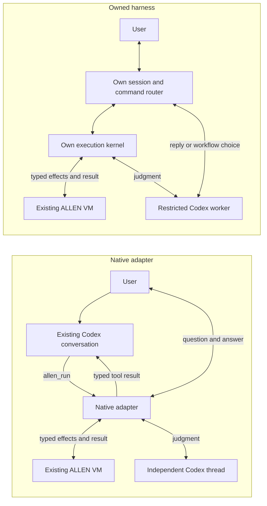

# Findings from building the two prototypes

Both paths work for the agreed prototype slice. Root independently ran the integrated setup, automated verification, interactive lifecycle checks, offline demos and actual model-backed demos. The practical discovery is that the existing ALLEN runtime is sufficient: the missing piece was a host that owns callback dispatch and keeps reading messages while work is pending.

## What we built

| Dimension | Native adapter | Owned harness |
|---|---|---|
| Conversation owner | Existing Codex app-server | Our terminal session and router |
| Entry into ALLEN | Parent model calls native `allen_run` | Slash command or model chooses registered review |
| Deterministic execution | Existing ALLEN VM | Existing ALLEN VM |
| Judgment provider | Separate Codex thread in the same app-server | Separate restricted `codex exec` worker |
| Callback routing | Adapter dispatches native JOSH effects | Own execution kernel dispatches native JOSH effects |
| Native tool example | Pure in-memory review receipt | Per-effect scratch review draft |
| Human input | One pending Boolean question | Schema-validated JSON questions |
| Final destination | Typed tool result returns to parent model, which summarizes | Typed task result returns to owned session and history |
| Reusable source entry | Dynamic tool accepts source and input | `/run file.allen [input.json]` |
| Conversational source authoring | Tool contract permits source; successful authoring not established by fixture demo | Not implemented; chat selects a registered workflow |
| Run lifecycle | One execution per CLI process | One active execution; sequential new runs allowed |
| Dependencies | Node builtins | Node builtins plus pinned AJV |
| Version-sensitive seam | Experimental app-server dynamic tools | Restricted CLI model-worker profile |

## Observed results

The native live run filtered three findings into two candidates, made one independent model judgment, invoked the receipt tool, asked one user question, and returned the typed result to the parent Codex conversation. The parent summarized it successfully. The bidirectional app-server reader continued processing while the parent dynamic tool awaited a child thread; that is the integration behavior the previous prompt relay could not reliably provide.

The owned live run filtered four tickets into two candidates, asked one model which required attention, validated the selected ID, wrote a scratch draft, asked one typed question, and completed. A separate live conversational run also demonstrated an ordinary reply followed by model selection of the registered workflow. The application owns that conversation and its task records.

Both direct workflows dispatched three callback replies in code and exposed zero forwarding envelopes to a model. Automated demo answers were explicitly labelled scripted fixtures. Separate subprocess checks exercised the actual interactive answer, status, wrong-ID, duplicate, cancellation, late-answer and exit behavior. The integrated suites passed 9 native tests and 17 owned tests, plus four root-level interactive scenarios. See [verification evidence](PROTOTYPE-VERIFICATION.md).

## Reused foundation

Both tracks use real `josh serve` and the existing ALLEN compiler/VM at revision `abb8a9782fc438d1b87e8aa2fdaea65e5db633c3`. The pinned binaries compiled successfully from source. Native routing is implemented in ordinary host code, bypassing the prompt-assisted MCP relay.

## JOSH framing reference mismatch

The native workstream observed that the agent-facing protocol reference describes netstrings, while the pinned executable and framing implementation use `Content-Length` / `Content-Type` headers. Both implementations must use the actual byte protocol. This is a documentation mismatch in the original project, not a reason to replace the runtime.

## Harness choices

The native track selected Codex app-server because its installed schema exposes client-executed dynamic tools and supported local login was available. Pi and OpenCode were considered; neither had locally configured authentication in the checked standard locations. Selection is practical for this experiment, not a conclusion about their comparative capability.

The owned track uses a separate bounded Codex execution for typed judgments while its own code controls the conversation, programs, questions, tools, and cancellation. This tests ownership of orchestration while borrowing a model worker. It does not yet establish a direct-provider implementation or same-agent callback semantics.

## Failures caught and corrected

- Awaiting a callback inside a blocking transport reader would deadlock the native parent/child interaction. Independent asynchronous dispatch keeps both transports moving.
- Closing readline did not release piped stdin. Root's independent interactive checks caught CLI shutdown failures in both tracks; explicit stdin shutdown fixed them.
- Native cancellation during initialization could leave the not-yet-assigned client running. A stalled-handshake regression now verifies ownership before awaiting startup and bounded subprocess shutdown. A separate actual-model probe also confirmed cancellation during the child judgment.
- Cancelling while the owned session asynchronously reads a source file could otherwise permit a delayed run to start. Session generations now invalidate that continuation, as well as late model selections.
- Repeated scratch-tool calls originally collided with a fixed filename. Each effect now has its own artifact, and the tool is correctly marked non-idempotent.
- Worker exit code zero and a valid result file were insufficient proof of completion. Independent review led to explicit `turn.completed` validation and rejection of malformed or unexpected trailing events, with four regressions.
- Turning off Codex feature flags alone did not remove all tool descriptions. The owned worker now uses a version-specific public model-catalog override and rejects unexpected tool events. No global configuration or credential files were copied or changed.

## What this means for the design

Your core hypothesis is supported: deterministic orchestration can live outside the model while the model retains meaningful judgment. Neither a new language nor a replacement VM was needed to prove it. A native host implementation already removes the model from provider-envelope routing.

For integrating ALLEN into a coding agent people already use, the native route is the smaller next investment. It preserves an existing conversation and proves that a parent tool call can stay open while independent judgments and user input complete. Its constraints are the host's tool API, configuration and turn lifecycle.

For the product you described—one session deciding between conversation, commands and running programs—the owned route is the clearer foundation. It provides a natural place for task visibility, interruption rules, capabilities and future recovery. It also makes you responsible for history management, provider compatibility, tool permissions and the interface. Its present Codex worker is a practical provider adapter, not evidence that those responsibilities have disappeared.

I would keep the native adapter as an integration reference and develop the owned prototype through three bounded experiments:

1. **Comparable workload:** run the same ALLEN program and dataset through both paths, recording total model usage, wall time and all parent/chat calls. Only then make a token or latency claim.
2. **Model-authored programs:** allow a structured source-producing action, compile it, return bounded diagnostics for repair, and enforce the same frozen capabilities and budgets. Measure successful completion on several unfamiliar tasks rather than one supplied fixture.
3. **Recovery:** record effect intent/outcome and test process loss before dispatch, during a model wait, and after an effect succeeds but before its reply is recorded. Define uncertain outcomes explicitly. Existing traces are insufficient for this.

Add a direct provider behind the owned `judge` interface when supported credentials are available, to separate the runtime design from the version-pinned CLI worker. Keep same-agent `agent.ask` as an explicit contract decision: define which context and actor it means, and whether an already-running parent can service that request without reentrancy deadlock. Neither prototype silently substitutes independent judgment for that behavior.

## Interpretation limits

The tracks use different synthetic review inputs. Compare execution ownership and lifecycle behavior; their token or latency totals are not a controlled performance comparison. Offline fixture decisions and automated fixture answers must remain visibly labelled. Live demonstrations exercise real model decisions with the same runtime path.

The prototypes have fixed tool registries and bounded single-file programs. They are local terminal experiments, not a full coding-agent UI or durable workflow system. Native app-server configuration may advertise inherited capabilities; detecting and interrupting unexpected tool activity does not reverse an already-started effect. The owned worker restriction profile is verified only for Codex 0.153.3. Neither path establishes a production sandbox, exactly-once effects, persistent sessions or reliable model-authored ALLEN.

Detailed implementation evidence: [native findings](../prototypes/native/FINDINGS.md), [native protocol contract](../prototypes/native/CODEX-CONTRACT.md), [owned findings](../prototypes/owned/FINDINGS.md), [owned worker audit](../prototypes/owned/CODEX-WORKER.md).
