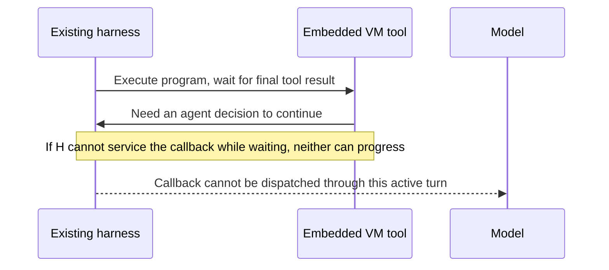
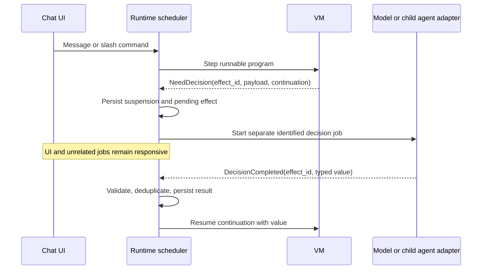

# Agent harness and protocol research

Research date: 2026-09-23. Scope: ten opened primary documentation sources; no paid API requests or credential inspection. These are documented capabilities, not an interoperability certification of installed versions. Recommendations and failure scenarios below are architectural judgments.

## Finding

The motivation for owning the harness is sound, but the defensible claim is **“one runtime can give us consistent scheduling, persistence, and effect handling,”** not **“existing harnesses cannot integrate.”** Existing protocols and products already expose parts of this design. Owning the runtime removes a class of incompatible lifecycle assumptions; it does not automatically solve durable execution, tool semantics, or authorization.

The proposed system should own the outer workflow and treat models and optional existing coding agents as executors. A model completion, a child agent run, a human answer, and a tool result should all arrive as identified events that resume explicit continuations. Avoid making the original calling agent responsible for remembering how to resume a nested runtime.

## What the documented interfaces actually support

### 1. OpenAI Responses: application-owned function execution

The documented function-calling flow is request → model tool call → application execution → correlated tool output → another model request. The application can repeat that loop. Calls have `call_id`; custom tools can accept free-form input, and grammar constraints are available. This is a direct fit for accepting ALLEN source as a tool input while retaining runtime control. Hosted tools have different execution ownership from application functions. [OpenAI function calling](https://developers.openai.com/api/docs/guides/function-calling)

**Implication:** a direct API adapter is a clean place to implement the proposed scheduler. It must preserve provider continuation items and call identity; a generic array of role/text messages is an inadequate persistence format.

### 2. OpenAI programmatic tool calling: a close existing analogue

Current documentation describes model-generated JavaScript in a fresh isolated V8 runtime, with top-level `await`, enabled tools, and output helpers. It lacks Node.js, direct networking, general filesystem access, subprocesses, and persistent JavaScript state between executions. The application still executes client-owned tool calls. `allowed_callers` selects direct/programmatic access. Tool search happens outside an already-running program. Model compatibility must be checked individually. [OpenAI programmatic tool calling](https://developers.openai.com/api/docs/guides/tools-programmatic-tool-calling)

**Implication:** “the model writes code to orchestrate tools” is already available. A new system needs a sharper contribution: persisted typed continuations, inspectable long-lived runs, repeatable effect policies, local execution, and useful recovery semantics. Those are proposed differentiators, not assertions that every vendor lacks every feature.

### 3. OpenAI async tools: avoid assuming every call blocks the model

Current Responses documentation lets application-run function/custom tools declare `async: true`; the model can continue before their outputs arrive. The application tracks the original call identity and the latest conversation response. Compatibility is GPT-6 Astra and later; async does not apply to hosted built-ins and must not be combined with programmatic tool calling. Multi-agent mode adds a restriction against combining async tools with parallel tool calls. [OpenAI async tool calling](https://developers.openai.com/api/docs/guides/async-tool-calling)

**Implication:** model adapters need explicit capability negotiation, not one universal “tool call” assumption. The new runtime can provide its own job handles without depending on this provider feature.

### 4. Codex app-server: an actual bidirectional harness interface

App-server exposes a bidirectional JSON-RPC-style protocol with threads, turns, streamed events, approvals, and elicitation. Experimental `dynamicTools` registered at thread creation produce `item/tool/call` requests for client execution; they require `capabilities.experimentalApi`. The documentation distinguishes stable and experimental methods and includes explicit experimental/unsupported warnings for app-server/WebSocket usage. Use a pinned binary/schema and verify the precise surface needed before selecting it for production. [Codex app-server](https://learn.chatgpt.com/docs/app-server)

**Implication:** a new chat client can embed Codex, and an ALLEN runtime can implement a dynamic tool handler. That is genuine integration. However, the documentation does not establish that arbitrary same-thread recursive agent re-entry is safe while an earlier tool handler is awaiting completion. Treat that as a testable unknown, not an available guarantee.

### 5. Codex SDK: useful subordinate executor

The SDK starts, continues, and resumes local Codex threads. Official guidance directs automation and CI toward the SDK and rich custom clients toward app-server. The current page also documents a stable Python SDK controlling app-server with a pinned CLI dependency. It states that `codex mcp-server` and the standalone server binary have been removed. [Codex SDK](https://learn.chatgpt.com/docs/codex-sdk)

**Implication:** use a dedicated Codex thread as a bounded coding worker, returning artifacts and structured status to the outer runtime. Do not build a new design around historical examples of the removed MCP server command. Conversation resumption is not evidence that an arbitrary embedded VM's execution stack is restored.

### 6. Claude Agent SDK: reuse a complete loop

The Agent SDK runs Claude Code's binary through Python/TypeScript, providing its loop, context management, built-in tools, sessions, hooks, subagents, MCP, and permissions. Its overview explicitly distinguishes this from the Client SDK, where application code owns API calls and the tool loop. The page also states that third-party products may not offer claude.ai login/rate limits without prior approval and directs developers toward API-key authentication. [Claude Agent SDK overview](https://code.claude.com/docs/en/agent-sdk/overview)

**Implication:** this is attractive when shipping a capable coding assistant quickly matters more than controlling every execution transition. It is less attractive as the semantic foundation for a provider-neutral VM. Build an adapter around a complete child run and keep workflow ownership outside it.

### 7. Anthropic programmatic tool calling: explicit suspension is established practice

Claude can generate Python that calls tools within its code-execution container. A tool call pauses execution, returns `tool_use` to the application, and resumes when the application supplies the result. Intermediate data can stay outside model context. Current docs require code execution version `code_execution_20260120` or later. Restrictions include unsupported `strict: true` tools, recursive input schemas, and MCP-connector tools. Pending tool responses have an approximately four-minute timeout. [Anthropic programmatic tool calling](https://platform.claude.com/docs/en/agents-and-tools/tool-use/programmatic-tool-calling)

**Implication:** the suspend/return-result/resume concept is viable. A hosted container's pending-call lifetime should not be the persistence mechanism for a workflow that waits overnight for a person. The local runtime needs its own stored continuation and a fresh provider interaction when appropriate.

### 8. MCP sampling: callbacks exist, but capability support matters

MCP revision 2025-11-25 defines server-requested sampling through the client, including tool-enabled sampling when the client advertises `sampling.tools`. The server can supply tool definitions, receive model tool requests, execute them, and submit another sampling request. The client controls model selection and permissions. The specification's prior automatic-context options are soft-deprecated. [MCP sampling](https://modelcontextprotocol.io/specification/2025-11-25/client/sampling)

**Implication:** MCP does not inherently prohibit server-to-model callbacks. Sampling is not a guarantee of access to the parent agent's exact conversation, reasoning continuation, built-in tools, or UI. A client's support for ordinary MCP tools does not establish support for sampling-with-tools. Probe capabilities and fail explicitly when absent.

### 9. MCP elicitation: human interaction is also a protocol feature

Elicitation supports in-band forms and out-of-band URL interactions, separately declared by the client. Requests must use supported modes. Forms collect structured user data; URL mode keeps the external interaction's data outside the client. [MCP elicitation](https://modelcontextprotocol.io/specification/2025-11-25/client/elicitation)

**Implication:** a runtime need not overload ordinary assistant text with “please call resume now.” It can expose an explicit pending question with a correlation ID and map that onto elicitation where supported. The runtime should also support its own chat UI path, since protocol declarations do not establish a particular host's UX quality or persistence behavior.

### 10. MCP tasks: deferred results, not a complete workflow engine

The 2025-11-25 specification marks tasks experimental. Negotiated task support wraps selected requests in identifiable state machines; initial acceptance returns task metadata, with polling and later result retrieval. States include `working`, `input_required`, and terminal outcomes. Task-related messages carry correlation metadata, and task records/results may expire according to TTL. Tool-level task support is additionally negotiated. [MCP tasks](https://modelcontextprotocol.io/specification/2025-11-25/basic/utilities/tasks)

**Implication:** tasks can carry a runtime job handle across an integration boundary. The application must still implement durable storage, deduplication, restart, and business side-effect semantics. This note is explicitly about the named protocol revision; do not assume its experimental wire shape remains the right target for future revisions/extensions.

## Three ownership choices

The comparison below is engineering judgment based on the interfaces above.

| Approach | What the new project owns | Main benefit | Main compromise |
|---|---|---|---|
| Existing harness + ALLEN tool | Program runtime and integration adapter | Fastest experiment with strong existing agent behavior | Nested lifecycle, capabilities, cancellation, and UI remain host-dependent |
| New outer runtime + existing agents as workers | Workflow state, scheduler, UI, policy; worker adapters | Reuses coding capability while centralizing long-lived work | Worker internals remain separate; retries and artifacts need clear boundaries |
| New outer runtime + direct model APIs | Workflow state plus model/tool loop | Maximum control of effects and continuation semantics | Must build context management, tools, permissions, streaming, and evaluation |

**Recommendation:** implement the smallest direct-model vertical slice to establish semantics, then add an existing-harness worker adapter. Avoid making third-party same-session callback behavior the critical path. Keep a native host integration as an optional delivery mode, not the only way the runtime can operate.

## The failure mode to design away

This is a hypothetical integration hazard, not a diagnosed explanation of any particular Josh/Allen failure:

An owned scheduler should use explicit jobs instead:

The important distinction is between logical waiting and blocking the scheduler. A parent workflow may wait for a child decision while the event loop continues handling the child and user input. Thread history, execution continuation, and external side effects are three different stores of state.

## Practical proof before a large build

1. Implement one deterministic program that reads data, asks a model for a typed decision, asks the user a question, and resumes after a process restart. Use a fake model and fake tools first.
2. Add a direct API adapter and one real read-only tool; verify complete call/result correlation and continuation preservation. Run this only when API access is intentionally configured.
3. Add a child-agent adapter using a separate session/thread. Prove the parent remains responsive while the child performs several tools. Define whether cancelling the parent also cancels the child.
4. Kill the runtime after recording a tool intent, after dispatch, and after receiving a result. Prove which cases recover automatically and which become an explicit unknown outcome. Never claim exactly-once external effects merely because local events are deduplicated.
5. Compare ordinary direct tools, vendor programmatic tools, and ALLEN on the same three workflows. Measure wall time, model turns, tokens, recovery success, user interventions, and implementation complexity.
6. Reject the larger language/harness investment if its useful advantage is only batching tool calls. Continue if inspectable state, reliable resumption, and predictable effects materially improve real work.

## Remaining uncertainties

- Actual sampling, elicitation, and task support of each target installed harness needs a capability probe; the MCP specification alone cannot settle that.
- Same-session recursive entry, cancellation propagation, and restart of an in-progress dynamic tool call require small harness-specific experiments.
- A subscription or local agent installation does not by itself establish API entitlement or third-party product authentication rights.
- Vendor docs change quickly. Pin versions and preserve protocol conformance tests; the ten sources above describe the researched snapshot, not permanent contracts.
