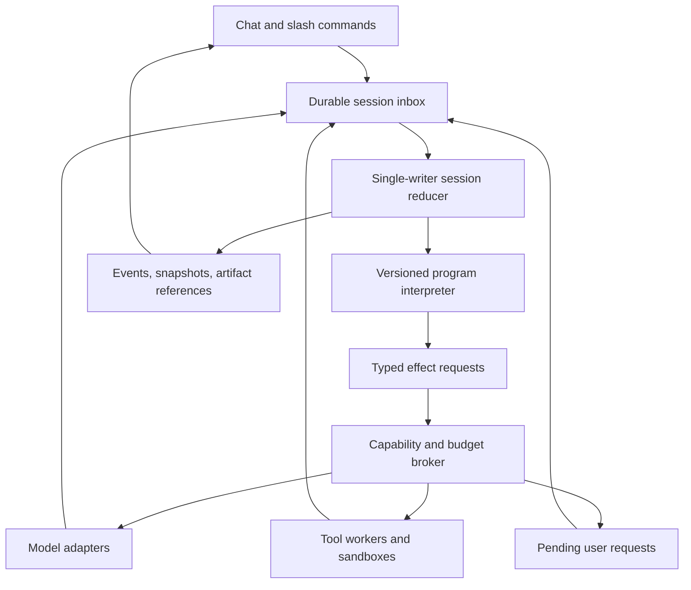

# Runtime precedents for a unified agent, language, and VM

Research date: 2026-09-23. Scope: primary-source precedents, execution semantics, and build-versus-borrow decisions. This note does not evaluate the existing JOSH/ALLEN implementation. Statements labelled **Recommendation** or **Assessment** are design judgments, not claims made by the referenced projects.

## Finding

**Assessment:** A unified runtime is technically credible. The strongest existing pattern is a durable state machine that owns the conversation, executable program, outstanding effects, and resumption events. Models become nondeterministic workers called by that state machine. The novel opportunity is the interaction model and program representation; crash recovery, queues, capability boundaries, and side-effect reconciliation have substantial prior art.

Owning the scheduler resolves a real integration problem: a program can request model work, human input, tools, or child agents without trying to re-enter an external harness whose control loop it does not own. It does not automatically provide secure execution, safe retries, or a useful conversational interface. Those remain separate engineering obligations.

## 1. LangGraph: persisted agent state and explicit interruption

**Documented:** LangGraph separates thread-scoped checkpoints from cross-thread stores. Persistent checkpointers support conversation continuity, interruptions, and fault recovery; its in-memory saver loses checkpoints at restart. Its documentation also identifies checkpoint growth as a storage and latency concern. [LangGraph persistence](https://docs.langchain.com/oss/python/langgraph/persistence)

An `interrupt()` exposes a serializable payload and waits for a resume value associated with the same thread. Resumption restarts the interrupted node from its beginning, so preceding code executes again. Multiple pending interrupts can be resumed by mapping interrupt IDs to values. [LangGraph interrupts](https://docs.langchain.com/oss/python/langgraph/interrupts)

**Recommendation:** Give every pending question or effect an explicit ID. Treat “resume with this answer” as a typed event, rather than feeding an unstructured chat message into whichever coroutine happens to be blocked. If ALLEN promises instruction-level continuation, implement and test that promise; a checkpointed node is not equivalent to a saved instruction pointer. Either design is workable, but their side-effect semantics differ.

**Build versus borrow:** LangGraph is a useful baseline for measuring whether a custom language adds value beyond an agent graph plus checkpoints. Rebuilding its graph API is unlikely to be the useful differentiator.

## 2. Temporal: deterministic control flow around recorded effects

**Documented:** Temporal requires workflow code to emit a compatible sequence of workflow commands when replayed against its event history. LLM calls, API calls, and database interactions belong in Activities, outside deterministic workflow replay. Both intrinsic nondeterminism and incompatible code changes can break replay. Temporal provides workflow versioning approaches for long-lived executions. [Temporal workflow definition](https://docs.temporal.io/workflow-definition)

**Recommendation:** The VM should make model requests explicit effects whose completed results are recorded. Recovery must reuse the recorded output instead of asking the model again. A model-generated program is also an output artifact: persist its exact source or IR before execution, and pin its interpreter/language version. Otherwise a restart or upgrade can change the program underneath an existing continuation.

**Build versus borrow:** Borrow Temporal when distributed execution and operational recovery are product requirements. For a local experimental CLI, a separate workflow platform may obscure the interaction hypothesis with deployment and integration work. This is a project-scope judgment, not a performance comparison.

## 3. Restate: durable sessions, objects, and promises

**Documented:** Restate offers keyed Virtual Objects with retained state and one writer per key, with concurrency across keys. Its documentation explicitly includes chat sessions and agents as use cases. Workflows have one main run per workflow ID and concurrent shared handlers that can resolve workflow promises. Deployments are immutable; existing invocations continue on their original deployment while new requests route to the latest version. [Restate services](https://docs.restate.dev/foundations/services)

Restate journals nondeterministic operations wrapped in `ctx.run`. It supplies replay-consistent time and randomness, configurable retries, and terminal errors. Its current TypeScript documentation warns that long LLM calls can require adjusting inactivity/abort timeouts. Restate context operations cannot be nested inside `ctx.run`. [Restate durable steps](https://docs.restate.dev/develop/ts/durable-steps)

**Recommendation:** Model a session as a mailbox with a single writer to authoritative state. Run long external calls outside that writer's critical section; their results return as events. This allows a new user message or cancellation to be handled while a model call is outstanding. Borrow the durable promise concept for user answers and child results, but avoid mapping every wait onto a live in-memory JavaScript Promise.

**Build versus borrow:** Restate is a particularly close conceptual comparison for a session runtime. A short prototype should test its workflow interaction model before implementing distributed mailboxes and suspension from scratch. Do not put the whole interpreter in one durable step: it would hide internal effects and defeat useful recovery boundaries.

## 4. DBOS: a smaller infrastructure surface for durable functions

**Documented:** DBOS is an application library using PostgreSQL for workflow checkpoints and queues, without a separate orchestration server. Recovery re-executes the workflow with checkpointed inputs and returns stored outputs for completed steps. Workflow functions must be deterministic; incomplete steps can retry and should be idempotent. Large outputs increase checkpoint sizes, so the docs recommend storing large blobs separately and returning references. [DBOS architecture](https://docs.dbos.dev/architecture)

DBOS offers persisted workflow messaging, events, and append-only streams. Its documented delivery guarantees depend on the calling context: messaging from ordinary code needs an idempotency key for deduplication, and stream writes from retried steps may repeat. [DBOS workflow communication](https://docs.dbos.dev/typescript/tutorials/workflow-communication)

**Recommendation:** Put artifacts and large tool results behind stable references. Separate the durable control log from the model's context window and the UI's streaming buffer. A terminal reconnect should resume display from a stream cursor without starting model work again. Stream fragments should carry IDs so clients can deduplicate replayed output.

**Build versus borrow:** DBOS deserves evaluation for a TypeScript or Python service whose team already accepts PostgreSQL. It still imposes replay semantics; adding it does not make arbitrary mutable interpreter state durable. For a single-user proof of concept, a narrowly scoped SQLite event log is a reasonable alternative, provided it makes no distributed reliability claims.

## 5. smolagents: code actions work, but boundaries remain hard

**Documented:** Hugging Face's `CodeAgent` executes model-generated code. Its local executor interprets Python AST operations with restrictions on imports and an operation budget. The documentation explicitly warns that local Python restrictions do not provide complete isolation. It distinguishes sandboxing snippets from sandboxing the entire agent. Its documented snippet-only sandbox path has limitations for managed agents because model calls need credentials; moving the entire system into a sandbox changes that credential boundary. [smolagents secure code execution](https://huggingface.co/docs/smolagents/tutorials/secure_code_execution)

**Assessment:** This independently supports the user's observation that code-to-agent callbacks are more difficult than simply exposing a code execution tool. It is evidence of an architectural boundary, not proof that every existing harness is incapable of supporting callbacks.

**Recommendation:** Let sandboxed programs emit a `ModelRequest` or `AgentRequest` to the host capability broker. The trusted host owns credentials and executes the request; the sandbox receives a typed result. A custom language can help expose this boundary explicitly. Its type checker is not a replacement for process isolation when host tools can execute arbitrary code.

## 6. WebAssembly Component Model: a useful capability analogy

**Documented:** A Component Model world declares imported and exported interfaces. Components interact across that boundary through those interfaces; required imports must be supplied by the host or other components. A component without a secret-store import cannot access a secret store through that interface. [Component Model worlds](https://component-model.bytecodealliance.org/design/worlds.html)

**Recommendation:** Use the same principle even if the first VM is an interpreter: a program declares the effects it may request, and the host supplies narrowly scoped implementations. A broad `shell()` import substantially expands practical authority regardless of how small the language looks.

**Assessment:** Wasm is a candidate for isolating executable extensions, not a prerequisite for the proposal. This source establishes interface boundaries, not durable continuations. Compiling to Wasm would not itself solve checkpointing, human waits, model callbacks, or external side-effect ambiguity. An explicit-state interpreter may be easier to inspect and persist during the experiment.

## Shared failure modes the proposal must handle

These are design deductions from the preceding execution models, rather than additional product claims.

| Failure | Why unification alone does not fix it | Proposed behavior |
| --- | --- | --- |
| External write succeeds, then worker dies before saving its result | Local state cannot prove whether the remote system committed | Stable effect ID and provider idempotency key where supported; otherwise query/reconcile or mark `outcome_unknown` |
| Model output arrives after user cancellation | Cancellation and completion race across a network | Record cancellation and completion order; discard late output for control decisions while preserving accounting |
| User answers after the program changes | A generic “yes” can bind to the wrong pending action | Bind answers to request ID, program revision, and concrete action digest |
| Restart changes an LLM-generated plan | Asking the model again can produce a new branch | Persist generated programs and accepted model results before dependent work |
| VM/library upgrade changes execution | Saved continuations depend on code and data shape | Pin version; explicit migration, compatible replay, or restart from a reviewed boundary |
| Two clients mutate the same session | A shared transcript is not a concurrency protocol | Ordered inbox and one authoritative reducer per session |
| Model loops through tool failures | Durable execution can preserve an unproductive loop | Runtime limits on iterations, model calls, time, spend, and repair attempts |
| A broad tool bypasses all narrow language effects | Capability strength is determined by the host adapter | Tool policy and OS isolation must enforce the intended boundary |

The first row is especially important: durable logical workflow execution and exactly-once external effects are different claims. DBOS explicitly requires idempotent steps; Restate retries failed durable steps. A language cannot wish away the period between a remote effect and its durable acknowledgment. [DBOS recovery semantics](https://docs.dbos.dev/architecture), [Restate durable steps](https://docs.restate.dev/develop/ts/durable-steps)

## Suggested prototype architecture

This is a recommendation synthesized from the research, not an existing API.

The important seam is `runUntilEffect(state) -> transition`, not “execute an opaque script and hope the harness can receive a callback.” A transition contains the next serializable state plus an effect request. The host commits that transition before dispatching work. When the effect completes, its outcome enters the inbox; the VM resumes using the recorded outcome. Pure instructions between effects can execute without a persistence write per instruction.

**Recovery choice:** Workflow replay reconstructs progress by running compatible control code again while substituting saved effect results. An explicit continuation snapshot instead stores the instruction position, serializable frames and values, program version, and pending effect ID. It resumes that captured machine state. This proposal can use either approach, but they are not interchangeable: snapshotting native closures or OS resources is outside the simple design, and replay requires stable control semantics. The suggested small interpreter uses explicit state at effect boundaries, while an event log supplies auditing and recovery of committed transitions.

**Adjacent option under investigation:** Cloudflare's [Durable Code Mode runtime](https://developers.cloudflare.com/agents/tools/codemode/durable-runtime/) is an unusually close comparison and is covered separately in the main proposal. It should be included in the build-versus-borrow decision before choosing a new language or execution substrate; this note does not independently assess that implementation.

For the first experiment, implement one session, one model adapter, a small typed effect set, durable human input, and a fake external write that deliberately creates an ambiguous outcome. Defer bytecode optimization, distribution, arbitrary package imports, and hot migration. Compare this against a graph/checkpoint baseline using the same tasks and models.

## Experiments that would change the recommendation

1. **Nested callback:** model writes a program; it requests a child agent; the child requests user input; the answer resumes both frames. Success means no model-generated routing boilerplate and no leaked credentials.
2. **Crash matrix:** terminate before dispatch, during execution, after remote success, after durable completion, and during UI streaming. Inspect actual effects, duplicates, unknown outcomes, and resumed output.
3. **Steering race:** send “stop publishing; just prepare a draft” while work is pending. The runtime should distinguish revocable future work from a remote action already committed.
4. **Language value:** compare a small ALLEN-like surface with typed structured plans and ordinary host-language workflows. Measure syntax repair rate, successful tasks, model calls, wall time, and operator effort. A custom language earns its complexity only if it improves these outcomes or makes important guarantees enforceable.
5. **Backend swap:** implement the same effect contract using a local event log and one borrowed durable engine. If the runtime requires a wholesale rewrite, its control semantics are coupled too tightly to persistence.

**Viability assessment:** Strong for a focused research system; plausible for a useful single-user development harness; substantially harder as a secure multi-user platform. The most defensible starting claim is “one owner for conversation and program execution, with inspectable durable effects,” not “a new general-purpose VM that makes agents reliable.”
