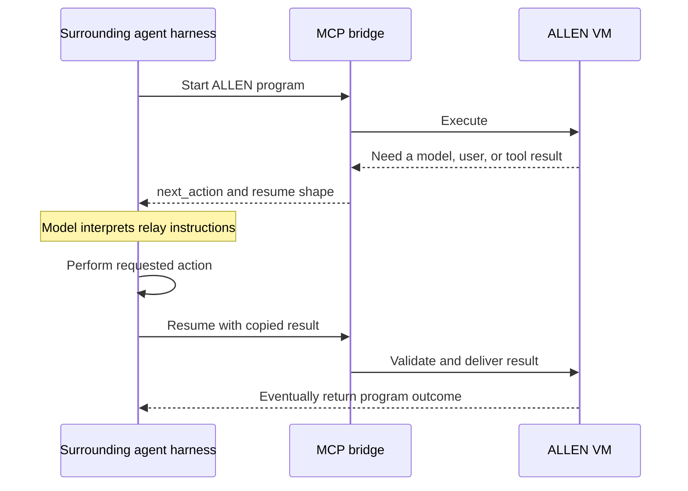
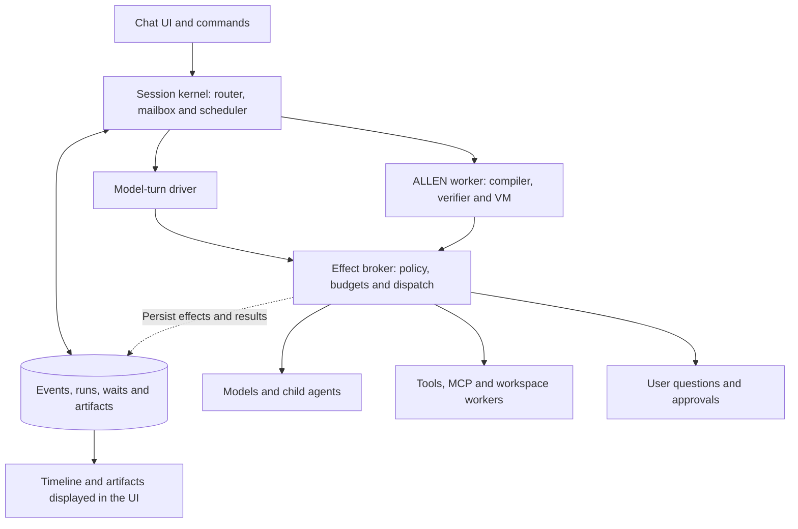
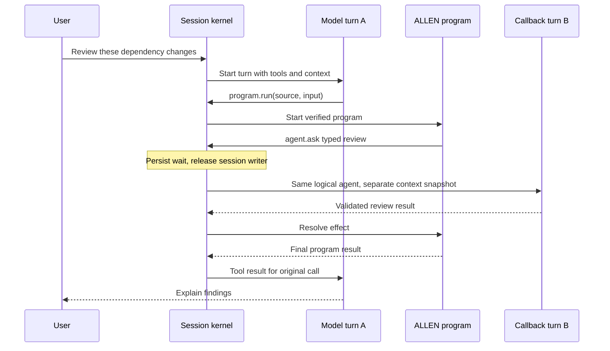
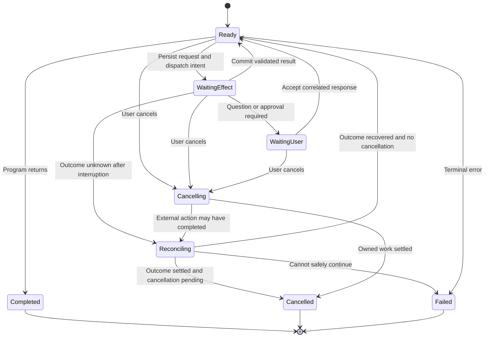

# A unified JOSH/ALLEN agent runtime

**Research and architecture proposal · 23 September 2026**  
**Status:** recommendation and design, not an implemented runtime.  
**Source baseline:** [`mcreenan/josh-allen` at `abb8a978`](https://github.com/mcreenan/josh-allen/tree/abb8a9782fc438d1b87e8aa2fdaea65e5db633c3), committed 30 August 2026.

## 1. Assessment

**The idea is technically viable, and it addresses a real ownership problem. I recommend a bounded experiment that makes JOSH the owner of the agent session, while retaining ALLEN as its deterministic execution engine. I would not begin by replacing the language or building a general-purpose virtual machine.**

The compelling product is a conversational environment in which a model can write a program, that program can ask for judgment or user input, and the environment can manage all of this as one inspectable task. The user should not have to ferry requests between execution systems. A program should be able to wait without losing its place or consuming a model turn just to explain how to resume it.

Three qualifications substantially affect the decision:

1. **The existing ALLEN foundation is useful.** There is already a compiler, independently verified bytecode, a VM, effects, capability checks, structured concurrency, and test replay. Much of the proposed language/VM work already exists. The repository audit below separates those assets from the missing lifecycle machinery.
2. **A new harness is one solution, not the only solution.** Native integration with an extensible harness could remove the prompt-mediated relay. It deserves a short comparison experiment before a major commitment.
3. **Owning the loop solves routing; it does not automatically solve durability, model reliability, or uncertain external actions.** Those need explicit semantics and tests.

My confidence is **high** that an owned harness can eliminate manual callback forwarding, **moderate** that this can become a useful personal tool within a few months, and **unproven** that a custom language will outperform a simpler code-mode harness on enough tasks to justify maintaining it. A competitive general coding agent is a substantially larger undertaking.

The strongest reason to build it is **reliable, inspectable workflows that mix rules and judgment**. “The model writes code that calls tools” is already well represented in current products. The advantage to demonstrate is that execution remains understandable and controlled when it waits, branches, receives new instructions, fails, or resumes.

## 2. What I understood your idea to mean

I interpreted “semi virtual machine” as an application-level execution environment: programs, suspended work, typed values, model requests, tools, artifacts, and conversations share a lifecycle. It does not imply emulating a computer or keeping a model's internal state in memory.

The system would let you:

- Chat normally when a conversation is sufficient.
- Use commands such as `/run`, `/jobs`, `/pause`, and `/inspect` for precise operations.
- Let the model choose an ordinary tool call or generate a bounded ALLEN program.
- Let that program perform deterministic work and request a model, agent, tool, or user when needed.
- Keep the interface responsive while programs wait or work in the background.
- Inspect the task tree and resume eligible work after a process restart.

I assume an initial **single-user, local-first developer tool**, one workspace and one model provider at a time. Remote deployment, multi-user tenancy, arbitrary plugins, and complete parity with established coding agents are later decisions. These assumptions reduce the first experiment without limiting the eventual architecture.

## 3. What JOSH/ALLEN already establishes

The repository's purpose matches this direction: move repeatable control flow out of repeated model turns while keeping judgment available through typed calls. Its current implementation goes well beyond an execution wrapper. The evidence in this section comes from a pinned source checkout, not just the installed plugin description. See the [source audit](research/josh-allen-audit.md) for implementation and test links.

| Asset | Current evidence | Reuse decision |
|---|---|---|
| Language and compiler | Typed source, closed effects, HIR/MIR, bytecode verification | Retain; freeze language expansion during the harness experiment |
| VM | Register machine, explicit task state, deterministic scheduling, provider completion validation | Retain for bounded program execution |
| Runtime providers | Separate tools, invoking agent, model, user, and sub-agent providers | Make these the native dispatch seam |
| Capability and catalog contracts | Declared effects, grants, frozen typed tool catalog, host projection | Retain and connect to the owned tool registry |
| Structured concurrency | Task ownership and cleanup rules | Retain; define how durable task identity relates to execution-local handles |
| Test replay | Artifact-bound recorded provider results and completion ordering | Retain for verification; do not equate it with restart recovery |
| Headless tools | Executor integration can invoke explicitly granted tools without a model relay | Useful existing adapter; not a complete agent harness |
| Prompt-assisted MCP bridge | Returns a `next_action` for the surrounding agent to perform and resume | Keep as compatibility support, outside the native execution path |

Sources: [implementation specification](https://github.com/mcreenan/josh-allen/blob/abb8a9782fc438d1b87e8aa2fdaea65e5db633c3/docs/implementation-spec.md), [runtime provider interface](https://github.com/mcreenan/josh-allen/blob/abb8a9782fc438d1b87e8aa2fdaea65e5db633c3/crates/allen-runtime/src/lib.rs#L908-L922), and [roadmap](https://github.com/mcreenan/josh-allen/blob/abb8a9782fc438d1b87e8aa2fdaea65e5db633c3/ROADMAP.md).

Two existing proposals are particularly relevant. **PD-11** already plans native provider routing beyond its implemented projection phase. **PD-1** proposes SHOUT, a durable host with explicit workflow checkpoints. This proposal combines session ownership with that direction; it does not discover a wholly missing concept. It makes a different initial product choice: one local application owns the conversation and orchestration. Do not operate SHOUT and a new session kernel as competing authorities over the same run. [PD-11](https://github.com/mcreenan/josh-allen/blob/abb8a9782fc438d1b87e8aa2fdaea65e5db633c3/roadmap/proposals/PD-11.md), [PD-1](https://github.com/mcreenan/josh-allen/blob/abb8a9782fc438d1b87e8aa2fdaea65e5db633c3/roadmap/proposals/PD-1.md).

### The integration problem, precisely

Today's prompt-assisted path is conceptually:



The bridge can describe a request, but the outer harness still owns the model loop, callable tools, user channel, and conversation identity. The integration has to reconstruct a return path across those ownership rules. Better prompting can make it work more often; it cannot create a native scheduling contract.

**My inference:** your frustration is primarily evidence that the current adapter is too indirect for the desired execution model. It is not evidence that typed agent programs themselves are unviable. The source supports that narrower diagnosis, but I have not reproduced your particular failed sessions or measured their failure rate.

## 4. What the research changes

Several adjacent systems already solve pieces of this problem. The following is a decision table, not a feature-parity claim. Detailed source notes are in [harness and protocol research](research/harness-protocols.md) and [runtime precedents](research/runtime-precedents.md).

| Precedent | Established capability | Consequence for this project |
|---|---|---|
| Codex app-server | Threads, turns, approvals, and experimental client-executed dynamic tools | Test a real native adapter before assuming an existing harness cannot cooperate |
| Claude Agent SDK | Existing agent loop with custom tools and hooks | Can supply a coding worker or an integration baseline; its internal lifecycle still needs mapping |
| MCP sampling and tasks | Negotiated model-request facilities and experimental long-running task facilities | Useful protocols; client support and session semantics still matter |
| Anthropic programmatic tool calling | Model-generated code orchestrates client tools | Code-based tool composition alone is not a differentiator |
| Cloudflare Code Mode | Generated code, isolated execution, persistent call history, approval replay, reusable snippets | Closest direct comparison for the proposed product |
| LangGraph | Persisted graph execution and human interrupts | Strong baseline for an explicit workflow design |
| Temporal | Deterministic workflow replay around external activities | Established lessons for histories, nondeterminism, and versioning |
| Restate | Durable execution and keyed stateful objects | Close conceptual fit for a durable session with serialized state changes |
| DBOS | Durable workflows built around database persistence | A smaller infrastructure alternative to evaluate for a hosted design |

Primary sources: [Codex app-server](https://learn.chatgpt.com/docs/app-server), [Claude Agent SDK](https://code.claude.com/docs/en/agent-sdk/overview), [MCP sampling](https://modelcontextprotocol.io/specification/2025-11-25/client/sampling), [MCP tasks](https://modelcontextprotocol.io/specification/2025-11-25/basic/utilities/tasks), [Anthropic programmatic tool calling](https://platform.claude.com/docs/en/agents-and-tools/tool-use/programmatic-tool-calling), [Cloudflare durable Code Mode](https://developers.cloudflare.com/agents/tools/codemode/durable-runtime/), [LangGraph durable execution](https://docs.langchain.com/oss/python/langgraph/persistence), [Temporal workflow definition](https://docs.temporal.io/workflow-definition), [Restate services](https://docs.restate.dev/foundations/services), [DBOS architecture](https://docs.dbos.dev/architecture).

Cloudflare deserves particular attention. Its Code Mode design documents replay at approval points, checks call identity and arguments, and warns about nondeterminism and parallel call ordering. It also distinguishes paused executions from stale running executions; a durable log is not a promise that every interrupted computation resumes. Its Think harness documents a separate chat recovery path. **Inference:** integrating the conversation and program histories remains a real design concern even in this close precedent. [Code Mode internals](https://developers.cloudflare.com/agents/tools/codemode/how-it-works/), [Think recovery](https://developers.cloudflare.com/agents/harnesses/think/recovery/).

The opportunity is narrower and more interesting than inventing agent code execution: **give model turns and typed programs one understandable execution contract, with local ownership and an auditable effect history.** Whether that advantage matters to users must be tested.

## 5. Proposed architecture

Use “JOSH” for the application runtime and “ALLEN” for the program language and VM. Avoid adding a third product name until a separate deployment actually needs one.



“One runtime” means **one authority over task identity, scheduling, policy, and persisted state**. It can still contain multiple processes. An isolated worker is desirable for generated code; provider adapters can run out of process; a remote model is inherently external.

### Modules and their interfaces

| Module | Small public interface | Complexity hidden inside |
|---|---|---|
| Session kernel | `submit(event)`, `inspect(id)`, `subscribe(cursor)` | Routing, task lifecycle, ordered state transitions, cancellation, resumption |
| ALLEN worker | `start(launch)`, `deliver(effectResult)`, `cancel(reason)` | Verification, VM scheduling, runtime value validation, bounded execution |
| Effect broker | `request(effect)`, `reconcile(effectId)` | Authorization, dispatch, attempts, deadlines, result recording, uncertain outcomes |
| Model driver | `advance(turnSnapshot)` | Provider protocol, streaming, structured responses, tool calls, context assembly |
| Artifact store | `put(value, policy)`, `read(reference, principal)` | Large outputs, content hashes, retention and access controls |
| Conversation projection | `render(events, viewer)` | User-visible messages, progress, questions, artifact cards, history views |

These are proposed interfaces, not current ALLEN methods. Begin with only the implementations actually needed. In particular, do not invent a universal adapter hierarchy before the first two integrations reveal what varies.

### A concrete domain model

| Entity | Meaning and identity |
|---|---|
| Session | User-visible conversation and authorized workspace; may outlive many runs |
| Run | One accepted goal or program invocation, including its task tree |
| Task | One schedulable model turn, program, child agent, or external operation |
| Turn | One model interaction cycle with a pinned context view and provider metadata |
| Program revision | Immutable source, compiled artifact, dependencies, and catalog binding |
| Effect | A request to observe or change something outside deterministic computation |
| Attempt | One dispatch of an effect; several attempts may belong to one effect |
| Question / approval | A correlated request that can only be resolved by an authorized responder |
| Artifact | A typed reference to retained evidence, a patch, a report, or a larger result |

Use stable identifiers and parent links. A provider's response ID is metadata on a turn, not the application's session identity. A model context window is a projection of history, not the authoritative execution state.

The session kernel is a **single writer to a session's state transitions**. It must not hold that writer slot or a database transaction while waiting for a model, tool, or person. Dispatch external work, release the slot, then accept its completion as another event. Otherwise “one owner” becomes a deadlock.

## 6. Input routing and the user experience

Resolve explicit commands without a model call. Normal text becomes a session event; the model interprets its meaning within a clearly defined routing policy.

| Input | Initial behavior |
|---|---|
| Ordinary message while idle | Start a conversational turn |
| Ordinary message during a run | Record steering; make it available at the next safe decision point |
| `/run review.allen input.json` | Compile, validate grants, create a run, execute |
| `/jobs` | Show active, waiting, failed, and completed runs |
| `/inspect run-42` | Show source revision, task tree, effects, waiting reason, and cost |
| `/pause run-42` | Prevent new effect dispatch; report any already in flight |
| `/cancel run-42` | Request cancellation, stop new dispatch, reconcile in-flight effects |
| `/answer question-7 ...` | Validate and resolve that exact pending question |
| `/approve approval-9` | Apply an existing user permission decision to that exact action |
| `/resume run-42` | Resume only if its state and policy permit it |
| `/fork run-42` | Create a new run from retained evidence; apply new authority checks |

The names are illustrative. The invariant is more important: a message must not accidentally resolve the wrong wait. If the UI has one clearly targeted question, an ordinary reply can be bound to it by the client. Multiple pending questions require explicit selection. Unrecognized commands produce a command error rather than silently going to the model.

Steering also needs a policy. “Actually, exclude archived repositories” should not silently rewrite a running program. Record it, stop future dispatch if it changes the permitted action set, and have the model propose a revised program or a new run. Completed effects stay in the history. A status question can be answered from current state without disrupting the main run.

The interface should expose useful facts: “Scanned 18 repositories; waiting for your answer about 2 exceptions.” It should offer source, details, and effect history on demand. It should not make users understand provider call IDs to accomplish ordinary work.

## 7. The hard part: a program calls back into its agent

There are three different operations here, and keeping them distinct avoids much confusion:

- `model.request<T>`: request a typed judgment from a model with supplied context.
- `agent.ask<T>`: request judgment from the logical agent that owns this program, with a defined view of its session context.
- `sub_agent.run<T>`: create an independent agent task with explicitly projected context and authority.

These distinctions exist in current ALLEN. Preserve them. Do not silently turn `agent.ask` into an unrelated model call because an adapter cannot implement the requested semantics. [ALLEN agent operations](https://github.com/mcreenan/josh-allen/blob/abb8a9782fc438d1b87e8aa2fdaea65e5db633c3/docs/agents/reference/allen-language.md#85-invoking-agent-operations).

### Avoid recursive use of a blocked provider conversation

Suppose a model turn calls `program.run`, and the program calls `agent.ask`. The initiating provider turn is waiting for its tool result. Trying to append an unrelated assistant exchange into that unfinished protocol sequence is a bad foundation.

Instead, the kernel creates a **callback turn** belonging to the same logical session and agent, using a pinned, policy-filtered context snapshot. That turn has its own provider request and explicit parent link. Its typed result resolves the program effect. After the program finishes, its result closes the initiating tool call in the original turn.

This preserves logical agent identity while keeping provider conversations valid. It is a proposed native-host contract that must be specified and tested; it is not a capability the current prompt-assisted bridge already guarantees. A callback cannot require the unfinished parent turn to advance before producing its answer.



Start by proving this with `model.request`, then add `agent.ask`. The latter adds context and identity semantics beyond a simple provider call. Bound callback depth, total model calls, tool authority, and repair attempts across the entire run tree. Reject wait cycles. A blocked parent must not consume the sole worker slot needed to run its child.

For long waits, choose the interaction mode before dispatch:

- **Attached program:** the parent turn stays logically pending and eventually receives the final result.
- **Background run:** the initial tool call immediately returns a run handle; subsequent completion is a new session event.

Do not return both an early “started” result and a later final result under the same provider tool-call ID. A durable logical wait need not keep an HTTP stream open.

## 8. What the VM should and should not be

ALLEN should remain the place where deterministic control flow and typed values are enforced. JOSH should own external scheduling and durable identities. Avoid making the entire chat transcript a mutable global object inside the language.

Use a small instruction/effect vocabulary conceptually:

```text
Pure work:    calculate, branch, loop, call, construct typed values
External:     request model, invoke tool, ask user, operate on workspace
Scheduling:   start child, await result, cancel owned work
Lifecycle:    persist progress, wait for event, finish or fail
```

Only the first three groups partly describe existing ALLEN; durable lifecycle operations need new design. Timers, durable waits, artifact references, and persistent child identities must not be presented as existing language features.

### Choose persistence semantics before adding syntax

| Approach | Benefit | Cost | Recommendation |
|---|---|---|---|
| Explicit workflow state | Persist typed state at named steps; simple to inspect and upgrade deliberately | Authors/compiler must expose resumable steps | Safest first durable milestone; close to PD-1 |
| Deterministic replay to a live tail | Reconstruct local variables from recorded effects, then accept new effects | Requires strict histories, ordering, artifact pinning, and a new recovery mode | Good next experiment for seamless linear programs |
| Serialize the full VM continuation | Resume at exact instruction with registers and frames | Must persist handles, futures, tasks, resource ownership, versioning, and provider state | Defer until measured replay costs justify it |

**Recommended staging:** prove native callbacks with ordinary in-memory ALLEN execution; make the surrounding session and effect records durable; implement explicit workflow checkpoints; then evaluate replay-to-live for bounded linear programs. Report a running program as interrupted until its recovery profile actually supports resumption. Persisting chat history alone does not make arbitrary ALLEN execution durable.

Current test replay consumes a complete bound record without contacting live providers. Recovery that replays a committed prefix and then permits new effects is a distinct execution mode, with a distinct validation contract. Do not add “fall back to live” to the testing replay path. [Current replay contract](https://github.com/mcreenan/josh-allen/blob/abb8a9782fc438d1b87e8aa2fdaea65e5db633c3/docs/implementation-spec.md#11-replay-and-deterministic-testing).

If replay-to-live is implemented, its first profile should exclude durable opaque resource handles and concurrent effects. Pin source, bytecode, input, catalogs, runtime version, and observed effect results. Later concurrency needs stable task paths and recorded completion order; wall-clock arrival order must not silently change replay behavior. A “now” value, random choice, or live filesystem read is an external observation and must be recorded when it affects decisions.

## 9. Durability and external actions

The crucial distinction is between “we know what the program intended” and “we know what happened outside the process.”



This is a proposed run-state sketch. `Reconciling` may ultimately settle as cancelled when cancellation is pending; the implementation should carry cancellation intent separately so a recovered result never authorizes unintended new work.

### Effect dispatch contract

For each effect, persist at least:

```text
effect_id, run_id, task_path, sequence
operation, canonical_arguments_hash, input_schema_hash, output_schema_hash
artifact_hash, catalog_hash, grant_revision, context_revision
retry_class, idempotency_key, deadline, budget_reservation
status, attempt_ids, provider_request_ids, result_reference
```

In a single local transaction, append the effect request and an outbox entry. A dispatcher claims the entry and invokes the adapter outside the transaction. When it has a validated result, it atomically stores that result, resolves the wait, and makes dependent work runnable. Duplicate deliveries with the same identity and result become no-ops at this transport seam; conflicting duplicates are errors. This transport deduplication happens before handing a completion to ALLEN's stricter provider-validation interface.

There remains an unavoidable interval between an external system acting and the result being committed locally:

| Failure point | What the runtime knows | Permitted recovery |
|---|---|---|
| Before dispatch | Request exists; dispatch has not been claimed | Dispatch under current authorization |
| Dispatch claimed, no definite result | It may or may not have happened | Consult adapter retry/reconciliation contract |
| Remote action succeeded, response lost | Local state cannot establish success | Recover by idempotency key or external lookup; otherwise stop for reconciliation |
| Result committed, worker died | Effect outcome is known | Deliver recorded result; do not repeat action |
| User cancels during dispatch | New work is forbidden; current action may finish | Try adapter cancellation and record any eventual outcome |

A claim of universally “exactly once” would be incorrect. Use explicit retry classes: safe read, idempotent mutation with a documented key, reconcilable mutation, or ambiguous non-repeatable action. Even a read may incur charges, so budget accounting still applies. A retry uses the same effect identity; a deliberate new action gets a new identity.

Shell commands and opaque coding workers need special treatment. An `exec` operation may conceal many writes and network actions. The broker cannot infer their semantics from the command string. Run them in an isolated worktree, capture patch/results, and treat interrupted opaque work as requiring inspection. A narrowly typed `apply_patch(base_hash, patch_hash)` adapter is much easier to reconcile than “run arbitrary shell and retry on failure.”

### Storage and operational scope

For the local version, use SQLite for events, runs, effects, waits, leases, and projections, with an artifact directory for larger values. Use short transactions, a single writer, and explicit schema versions. An accepted user submission should not be acknowledged as durable before its transaction commits.

SQLite WAL supports concurrent readers but serializes writers. Choose durability settings intentionally, including `synchronous=FULL` for the proposed committed-event contract on supported local storage, and use SQLite-aware backups. Keep the database and its WAL consistent; copying only the main file while active is insufficient. These are database guarantees, not remote-effect guarantees. [SQLite WAL documentation](https://sqlite.org/wal.html).

For initial artifact storage, publish an immutable, fully written artifact before committing a database reference; tolerate and later collect unreferenced artifacts. Do not acknowledge a durable result whose only copy sits in a process buffer. Storage exhaustion should stop acceptance/dispatch cleanly.

No promise of work continuing while a laptop is asleep. Durability means it can recover when the application returns. Always-on execution needs an always-on host.

## 10. Context, permissions, tools, and budgets

### Context is a selected view of evidence

Keep three separate things: the durable event history, artifacts containing retained evidence, and the context assembled for a particular model turn. Summaries can help fit context windows; they must not replace the executable state or the original evidence needed for an important decision.

A callback context should record its source session revision, selected messages/artifacts, instructions, schema, and effective authority. Preserve provider-required opaque continuation data in the provider adapter where necessary. Do not assume private model reasoning is available or portable. A retry may produce a different answer; a committed answer is reused during recovery rather than regenerated.

Streaming text is provisional presentation until a completed response is accepted. Do not dispatch a tool from half-parsed streamed arguments. Interrupted streams need a documented rule for partial display, provider retrieval where supported, and bounded retry.

### One effect broker for both model calls and program calls

Every dispatch path should consult the same authorization decision. Otherwise an action rejected through ALLEN may still be available through a direct model tool call, defeating the reason for declaring effects.

**Concrete implementation gap:** wiring `RuntimeProviders` is sufficient for the first tool/model/user callback proof, but not for universal effect interception. Current filesystem, HTTP, and subprocess operations also dispatch inside the runtime's private broker; its override hook is replay-only. Initially deny those direct capabilities in supervised programs and expose needed operations as host-managed typed tools. Add a supported live broker seam before promising durable recording, pause, or revocation for every built-in effect. Do not repurpose the replay-only override. [Built-in dispatch](https://github.com/mcreenan/josh-allen/blob/abb8a9782fc438d1b87e8aa2fdaea65e5db633c3/crates/allen-runtime/src/lib.rs#L3410-L3425), [override restriction](https://github.com/mcreenan/josh-allen/blob/abb8a9782fc438d1b87e8aa2fdaea65e5db633c3/crates/allen-runtime/src/lib.rs#L1781-L1810).

The model can request authority; it cannot create it. Derive effective grants from session authorization, run policy, requested capabilities, and child projections. Existing user authorization should remain usable within its scope. Do not turn the application into a stream of redundant permission prompts.

For a newly required approval, bind the decision to the concrete action, arguments, program revision, principal, and expiry. A changed action requires a new decision. Recheck revocations before dispatch even if a catalog is frozen. A model's `approved: true` is a judgment value, never proof that a human granted permission.

### Tool catalogs

Own the tool registry rather than asking the model to reconstruct it. Provide discovery for relevant tools and full schemas before compilation. Define what “complete” covers: the configured host inventory under its stated policy, with unsupported/withheld items accounted for, not every possible tool in a user's accounts.

Pin the contracts a program compiled against. Reject unsupported JSON Schema forms or project them through an explicit documented adapter; do not silently weaken them into `unknown`. Handle tool removal or schema changes as a compatibility decision at a new run/revision. Dynamic authorization can narrow access without changing the meaning of a pinned contract.

### Bound the whole tree

Reserve a shared budget for parent and child work: model input/output tokens, monetary ceiling using configured prices, tool calls, duration, bytes, concurrency, and callback depth. Per-child limits alone allow a parent to overspend by spawning many children. Account for uncertain billed requests conservatively and reconcile actual usage when available.

Typed outputs prevent shape errors; they do not establish that a claim is true. Prompt injection in fetched content remains relevant. Treat tool output as evidence, restrict its authority, and enforce action policy in code. The host needs a real process/container sandbox for arbitrary native execution. Wasmtime could later sandbox selected extensions, but it does not provide the conversation or recovery model by itself. [Wasmtime security model](https://docs.wasmtime.dev/security.html).

## 11. Concrete examples

The following are **proposed behavior and illustrative workloads**, not benchmark results. The new workflow syntax is pseudocode, not a claim that current ALLEN accepts it.

### Example A: a dependency migration across repositories

**Request:** “Check these 25 repositories for the old API. Apply mechanical changes in worktrees, ask about ambiguous cases, and prepare a review report.”

1. JOSH records the goal, allowed repositories, and authority for local changes.
2. The model selects or writes a program against the repository adapter's pinned schema.
3. Deterministic steps inspect manifests and select affected files. Large file contents stay in artifacts.
4. A coding worker proposes patches in isolated worktrees. Its output is a patch plus test evidence, not unchecked edits to the user's main checkout.
5. The program sends only ambiguous changes to a typed review callback.
6. If a user decision is needed, the run waits while you continue chatting.
7. The program verifies base hashes, applies eligible patches, runs defined checks, and emits a report with unresolved cases.

Proposed workflow notation:

```text
workflow migrate(input: MigrationInput) -> MigrationReport
  requests: [repo.read, workspace.patch, test.run, model.review, user.ask]

  repositories = effect repo.inventory(input.repositories)
  candidates = select repositories needing input.target_api
  results = []

  for repository in candidates:
    checkpoint {repository, results}
    patch = effect coding_worker.propose_patch(repository, input.target_api)
    review = effect model.review<Review>({patch, constraints: input.constraints})

    match review:
      Accept(evidence):
        result = effect workspace.apply_patch(repository.base_hash, patch.hash)
        results.append(effect test.run(result.worktree, input.required_checks))
      NeedsUser(question):
        decision = durable_wait user.answer<Decision>(question)
        results.append(resolve_exception(repository, patch, decision))
      Reject(reasons):
        results.append(blocked(repository, reasons))

  return summarize(results)
```

The important feature is the explicit durable state and typed choice. Neither a model review nor a passing type check proves semantic equivalence; repository tests and human review still supply evidence. The first implementation can use prewritten programs while measuring whether model-authored programs are reliable enough.

### Example B: research that becomes a repeatable command

**Request:** “Compare the release notes for these six dependencies and flag changes that affect our integration.”

The program fetches allowed sources, records their timestamps/content hashes, extracts relevant sections, asks a model to classify ambiguous changes, and outputs a report with source references. Fetching and filtering stay outside the context window; the model sees a bounded evidence packet.

After a successful run, `/save-command dependency-review` can create a proposed reusable command with typed inputs and explicit effects. Saving should mean reviewing the source and fixtures, not merely remembering a prompt. Running the command next week creates a new run with fresh observations. Replaying last week's run uses its recorded evidence and performs no fresh writes.

This is a useful adoption path: **conversation → inspectable program → tested command**. Users do not need to start by learning a new language.

### Example C: an operational triage session

**Request:** “Investigate the failed deployment, compare it with the last healthy release, and suggest a fix.”

JOSH launches independent read tasks for deployment metadata, logs, and changes. Rules identify known failure signatures; a model reviews the remaining evidence. A separate policy distinguishes producing a proposed fix from executing a deployment action. You can say “Ignore the staging failure; production is the priority,” and the kernel records steering against the appropriate run.

If the process exits while waiting for an answer, a durable workflow restores that question. If it exits during a deployment mutation, the UI shows an uncertain operation until the adapter confirms the outcome. “Resume” cannot mean “send the deployment request again and hope.”

### Example D: invoice reconciliation with a later answer

A program matches exact invoice identifiers and totals using deterministic rules, then sends only exceptions to a model. A user answers an unresolved exception tomorrow. The run continues under the pinned policy with the answer associated with that exact exception. Generating a reconciliation report is straightforward; initiating payments adds external-effect and authorization requirements and should not be the first demo.

### Where this would add little value

A one-shot explanation, a simple shell command, or an open-ended brainstorming conversation is usually better served directly. Do not force every turn into an ALLEN program. Program construction and validation have real cost, especially when the work is unlikely to repeat or the rules are still unknown.

## 12. A worked recovery trace

This is a design fixture showing desired semantics. No runtime executed it during this research.

| Event | Persisted fact | What can happen next |
|---|---|---|
| 001 `GoalAccepted` | Session S, run R, input I, authority G | A model turn can begin |
| 002 `ProgramAccepted` | Source/artifact H and catalog C are immutable | Worker can start |
| 003 `EffectRequested` | Read effect E1 with stable arguments | Broker can dispatch |
| 004 `EffectResolved` | E1 result references artifact A | Worker consumes A |
| 005 `EffectRequested` | Review effect E2, schema Review, context revision 4 | Callback turn can begin |
| 006 `EffectResolved` | Typed judgment J is committed | Recovery reuses J |
| 007 `WaitOpened` | Question Q names R, exact patch P, schema Decision | User can answer Q |
| — process exits — | No durable fact is lost after acknowledged commits | Kernel restores the waiting state |
| 008 `AnswerAccepted` | Authorized user's answer to Q | Workflow resumes its checkpoint |
| 009 `EffectRequested` | Apply effect E3, base hash B, patch hash P | Recheck grants and dispatch |
| — response lost — | E3 outcome is uncertain | Enter reconciliation |
| 010 `EffectReconciled` | Workspace matches the expected applied patch | Record success without applying twice |
| 011 `RunCompleted` | Report artifact and final state | UI shows completion |

If the workspace does not prove the intended patch was applied, E3 remains unresolved or fails with an actionable explanation. The runtime must not invent a successful result. For APIs without a reconciliation mechanism, the equivalent trace stops for an operator decision.

## 13. Build choices and alternatives

| Option | What it buys | Main cost or limitation | Judgment |
|---|---|---|---|
| Extend the prompt-assisted bridge | Lowest immediate code change | Keeps model-mediated routing and host constraints | Useful compatibility path; weak foundation for this vision |
| Native adapter in an existing harness | Reuse mature coding tools/UI; remove relay | Must prove callback, context, interruption, and result semantics | Run a short spike |
| Own harness + existing ALLEN | Full lifecycle control; reuse language investment | You maintain model adapters, UX, policy, and recovery | Recommended experiment |
| Own harness + TypeScript/Python code mode | Familiar model-generated code and libraries | Durable state and effects need disciplined instrumentation | Essential baseline; may be the better product |
| Workflow framework + ALLEN activities | Reuse durable orchestration | Two execution abstractions; inline callbacks require careful mapping | Good if workflows dominate and host portability is secondary |
| New language + new VM + new harness | Maximum freedom | Largest uncertainty and maintenance load | Premature |

### Recommended implementation stack

Use a **Rust kernel and existing Rust ALLEN crates** for the local durable core, SQLite for persistent state, and a terminal interface initially. Run VM work behind a controlled worker seam. An existing synchronous execute call can run on a worker thread/process for the routing proof; this does not by itself provide durable stepping.

Use provider SDKs where they remove substantial protocol work, possibly in a small TypeScript adapter process if Rust support is cumbersome. That is an implementation tradeoff, not a reason to let the adapter own the session. Start with one provider; establish the interface from the second provider rather than inventing dozens of speculative abstractions.

For a quick independent baseline, a TypeScript harness can control `josh serve` through the existing protocol. The research audit identifies both this process seam and the native `allen-runtime` provider seam. Choose based on the first measurable experiment, not aesthetic preference.

Do not adopt Temporal, Restate, or a cloud platform solely to avoid writing a small local session store. Conversely, do not build distributed leases, sharding, and cluster failover if the actual product needs hosted durable workflows immediately; evaluate those systems first. The deployment goal determines the right amount of infrastructure.

## 14. Main obstacles and viability by area

| Obstacle | Severity | Mitigation and evidence to seek |
|---|---|---|
| Callback ownership and reentrancy | High, but tractable | Separate logical session from provider turns; verify exact nested-call trace |
| Process-restart recovery | High | Explicit state checkpoints first; kill workers at every persistence seam |
| Ambiguous external actions | Fundamental constraint | Adapter-specific idempotency/reconciliation; honest unresolved state |
| Model-generated ALLEN reliability | Unknown | Compile/repair measurements against familiar-language baseline |
| Custom schema/tool compatibility | Medium to high | Define supported schema subset; test representative real catalogs |
| Coding-agent quality | High product effort | Borrow workers and tools; avoid full parity as initial goal |
| Context quality over long tasks | High | Versioned evidence projections; evaluate omissions and stale judgments |
| Language/runtime upgrades | High for long waits | Pin old runs; explicit migration or restart; no silent artifact replacement |
| Cancellation and late completions | High | Fenced task generations, monotonic state transitions, reconciliation |
| Debuggability | Medium, essential | Source/effect timeline, typed errors, replay fixtures, cost attribution |
| Local sandboxing | High if running arbitrary commands | Reuse proven isolation and narrowly scoped brokers |
| Maintenance versus benefit | Largest strategic risk | Keep a baseline and stop if observed improvements do not justify complexity |

A type-safe program can enforce the wrong rule perfectly. A reliable runtime can reliably execute a poor plan. The product must make evidence and policy inspectable, while evaluation measures actual task outcomes.

My viability judgment depends on scope:

- **Personal research tool:** good prospect; current assets make the experiment worthwhile.
- **Useful bounded workflow assistant:** plausible, if native callbacks and recovery hold up under failure tests.
- **Reusable language/runtime for other harnesses:** possible, but integration support remains part of the product.
- **Universal replacement for established coding agents:** no basis yet for committing to that scope.
- **Arbitrary resumable native programs with exactly-once external effects:** not a defensible promise.

## 15. Implementation plan with gates

These are **engineering estimates**, not measured delivery commitments. Assume one experienced developer familiar with JOSH/ALLEN, sustained project time, one OS target, one model provider, and extensive reuse. Work ranges are additive person-weeks; part-time calendar time will be longer. Unknown source defects or provider limitations can expand them.

| Phase | Deliverable | Estimated effort | Exit criterion |
|---|---|---|---|
| 0. Define and compare | Three tiny routing proofs: native adapter, owned ALLEN harness, familiar-language harness | 1–2 weeks | Same nested callback completes without model relay; constraints recorded |
| 1. Own the loop | Chat, direct tools, ALLEN launch, model callback, user question, cancellation, task view | 2–3 weeks | Repeated nested executions preserve identity and valid provider transcripts |
| 2. Durable state | SQLite events/effects/waits, explicit workflow checkpoints, recovery and reconciliation | 3–5 weeks | Failure matrix passes; completed effects do not repeat in tested adapters |
| 3. Useful workflow | Repository review/migration demo, command reuse, evidence artifacts, budget accounting | 2–4 weeks | Workflow is useful in daily work and beats or matches baseline on defined criteria |
| 4. Harden alpha | Second provider, catalog compatibility, bounded child tasks, documentation and packaging | 2–4 weeks | Stable operation across representative sessions and interruption scenarios |

**Rough total: 10–18 full-time person-weeks for a focused alpha**, conditional on the gates. A convincing routing demonstration should be much earlier. A polished general coding agent with browser automation, rich editor integration, broad OS support, and hosted multi-user operation is outside this estimate and could add many months.

The first phase should not implement every path fully. Give the native-adapter spike a fixed budget. If it meets the required semantics cleanly, it may save the cost of owning a user-facing harness. If it cannot, document the specific missing contract rather than concluding that all harness integration is impossible.

### The first ten working days

1. Write the parent → program → model callback → program → parent trace as a fixture, including failure and cancellation.
2. Build a minimal session controller using the existing provider interfaces or native JOSH protocol. Use deterministic fake providers first.
3. Prove a user question can leave the UI responsive and resolve exactly once by question ID.
4. Add one real model adapter with a deliberately bounded tool catalog and spending limit when running the experiment.
5. Build the same task in an ordinary code-mode harness and a small native-adapter spike.
6. Compare correctness, implementation complexity, overhead, and observable failure modes. Choose the next investment from those results.

Do not spend these days on new syntax, a marketplace, distributed execution, or a sophisticated frontend.

## 16. Evaluation: how to decide whether it is worth continuing

Use the same model settings, inputs, connector fixtures, authorization policy, and task success rubric across alternatives. A stronger model in one harness would confound the comparison. Retain failing cases instead of repairing prompts until the benchmark stops representing the problem.

Start with 30–50 fixtures across five families: bounded data processing; a few typed judgment calls; tool composition; user waits/steering; and repository changes. Repeat the model-dependent cases at least three times and report distributions, not a single best run. These numbers are proposed pilot sizes, not statistical guarantees.

| Metric | What to record | Proposed initial gate |
|---|---|---|
| Native routing | Requested/completed effects, unmatched IDs, relay turns | Zero model turns spent forwarding protocol envelopes |
| Program usability | First compile success; success after at most two bounded repairs | Aim for ≥90% within the repair budget on pilot tasks |
| Task correctness | Independently checked final outcome and unauthorized-action count | No policy violations; no meaningful regression versus baseline |
| Recovery | Inject failure before/after dispatch and before/after commit | Every case completes, fails clearly, or enters explicit reconciliation |
| User waits | Wrong/stale/duplicate answers and restart while waiting | No answer resolves another question or a superseded revision |
| Costs | Provider tokens, billed requests, tool calls, retries, runtime overhead | Savings or reliability value must cover added complexity |
| Time | End-to-end time and time to useful partial result | Compare distributions by workload type |
| Debuggability | Time to identify the failing action and input | Developer can locate failure without reconstructing the chat manually |

The strongest pilot success is not necessarily lower token cost. It might be that a migration continues correctly after a restart, or a user can answer tomorrow without losing the work. Define the value before measuring it.

### Failure cases that belong in the acceptance suite

- Crash after a tool succeeds but before its result is saved.
- Duplicate completion, late completion after cancellation, and conflicting duplicate result.
- User answers a superseded question; two questions are pending at once.
- Program source or tool schema changes while a run waits.
- Model returns malformed typed output, requests an unavailable tool, or exceeds callback depth.
- Parent waits for child while worker concurrency is exhausted.
- New user instruction revokes permission during a running effect.
- Process dies during a streamed model response or artifact write.
- Database is full or an artifact referenced by history is missing.
- A replay request diverges from the recorded operation or arguments.

For correctness tests, use scripted providers and controlled adapters. For utility and model behavior, use paid API evaluations only in the implementation experiment; no live paid model evaluation was performed for this report.

### Stop or pivot conditions

Stop expanding the custom runtime if ordinary TypeScript/Python code mode delivers the same practical reliability with substantially less machinery. Retain ALLEN as an optional checked workflow language if it remains useful.

Prefer a native adapter if it provides the required callback, wait, and context behavior without fragile transcript manipulation. Prefer an existing durable workflow engine if most value lies in long-running business workflows rather than interactive session control.

Reconsider the language if model-generated programs frequently fail after bounded repair, even with good diagnostics and representative examples. Consider prewritten commands, a smaller generated intermediate representation, or a familiar syntax before changing model training.

## 17. Costs and unresolved questions

There is no measured cost advantage yet. A useful comparison is:

```text
total task cost = model input + model output + external tools + execution/storage
                 + expected recovery cost + human attention

net value of programming the workflow = avoided orchestration turns
                                      + avoided repeated work/errors
                                      - program generation/repair overhead
                                      - runtime maintenance
```

Fetch current provider prices when the experiment runs and record price/version assumptions with the measurements. Billing for timed-out model/tool requests can remain uncertain. A flat “fewer tool calls” metric misses code-generation and repair cost.

Questions this report cannot settle without experiments:

1. Can a native adapter meet your actual workflow needs in the harness you prefer?
2. How often do current models produce correct ALLEN programs compared with ordinary code?
3. Is explicit workflow state acceptable, or is seamless replay-to-live essential to the experience?
4. Which real tools expose idempotency or authoritative reconciliation?
5. Is the primary value coding work, personal automation, or durable operational workflows?
6. Does local ownership matter enough to outweigh the convenience of a hosted close precedent?

My suggested first product is **a local conversational workbench for bounded repository and research workflows**. Its signature demonstration should be: one request becomes a checked program, requests judgment naturally, waits for the user, survives a supported restart, and shows exactly what happened. That demonstration tests the idea you described without requiring an entire new programming ecosystem.

## 18. Research record and limitations

Research used the public JOSH/ALLEN repository at the pinned revision and current primary documentation. Supporting investigations:

- [JOSH/ALLEN implementation audit](research/josh-allen-audit.md): concrete reuse seams, bridge behavior, test evidence, and gaps.
- [Agent harnesses and protocols](research/harness-protocols.md): native integration alternatives and what model/tool protocols actually provide.
- [Durable runtime precedents](research/runtime-precedents.md): replay, explicit state, failure semantics, and build-versus-borrow options.

This is an architecture proposal based on source inspection and documentation. It is not a security audit, performance benchmark, complete review of all competing products, or working prototype. Supporting tests establish only their documented scope. New commands, workflow notation, lifecycle interfaces, and timings above are proposals. The original JOSH/ALLEN source was not modified.
