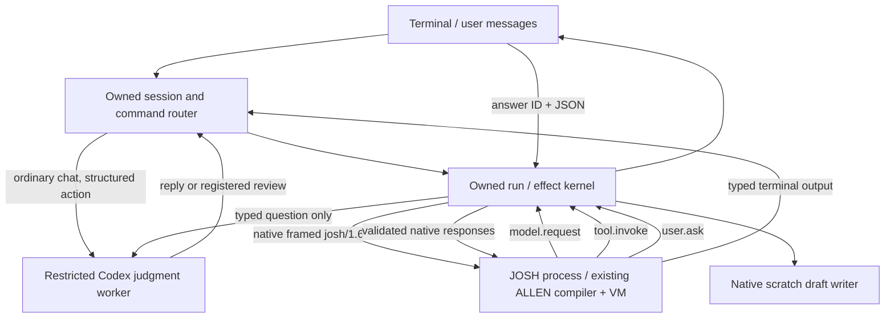

# Owned harness + existing ALLEN prototype

A runnable terminal harness owns the conversation, program execution, native callbacks, user questions, status and cancellation. ALLEN performs deterministic filtering and execution. Models make the selection judgments. This is a local, single-user experiment, not a production runtime.

## Run it

From the repository root:

```sh
bash tools/setup-josh.sh
cd prototypes/owned
npm ci
npm test
npm run demo
```

`npm run demo` uses the **real pinned ALLEN compiler/VM**, a clearly labelled deterministic model fixture, and a scripted fixture answer. It writes a harmless review draft under `.scratch/`. No external ticket is changed.

With `codex-cli 0.153.3` installed and signed in normally (`codex login status`):

```sh
npm run live     # actual model judgment, explicitly scripted human answer
npm start        # interactive chat, actual model judgment, actual typed answers
```

Offline interactive mode: `npm start -- --fixture`. Override the native binary with `JOSH_BIN=/absolute/path/josh` if needed. The default resolves the repository's shared `.cache/josh-allen/target/debug/josh`, including from a Git worktree. Dependencies are pinned in `package-lock.json`; Node 22+ is required. `npm run typecheck` performs syntax checks for this plain JavaScript prototype; it is not static TypeScript checking.

## Drive it

Say `Please triage the synthetic tickets` and the model chooses the registered review workflow. Say `What can you do?` and the model returns a conversational reply. The application retains visible chat history and task results in its own session, and supplies a bounded recent history to each separate judgment worker.

Commands route directly without a model call:

| Command | Behavior |
|---|---|
| `/review [goal]` | Start the registered synthetic-ticket review. |
| `/run file.allen [input.json]` | Compile and run another single-file ALLEN program through the same native runner. Paths currently cannot contain spaces. |
| `/status` | Show task state, pending questions, counters and final output. |
| `/answer QUESTION_ID {"accept":true}` | Answer the exact outstanding review question; `false` declines. Other programs may specify another schema. |
| `/cancel` | Abort the active model/chat worker and VM run; invalidate pending questions. |
| `/trace` | Show the active run's event trace. |
| `/quit` | Cancel owned work and exit. |

Copy the **whole** question ID shown by `user.question`. A mistyped, duplicate, late or other-run ID is rejected. An invalid answer leaves the question pending so it can be corrected. `/status` and `/cancel` remain responsive during model execution and while waiting for you. One VM run per session is supported; the VM may have multiple pending effects.

The sample scans four synthetic tickets, deterministically excludes a resolved incident and a low-severity typo, asks the model which of the two remaining issues deserves attention, validates that it chose an eligible ID, invokes the native draft tool, asks a typed Boolean question, and returns a typed result containing counts, selection, explanation, draft and answer. The model never receives wire request IDs or resume instructions.

## Architecture



`kernel.mjs` owns session/run/effect lifecycles. `transport.mjs` implements the actual framed bidirectional protocol, without the Python MCP relay. `provider.mjs` supplies either deterministic test judgments or a bounded Codex process. `schema.mjs` maps the supported ALLEN callback descriptors to exact JSON Schema. The compiler and VM remain the pinned upstream implementation at `abb8a9782fc438d1b87e8aa2fdaea65e5db633c3`.

The VM is initialized as **unattended, session binding none**. `model.request` is an independent judgment, not `agent.ask` into the original Codex conversation. Codex supplies the model-facing worker and login; this app owns the outer chat loop, ALLEN tasks, capabilities and user input. This tests ownership and native routing without building a provider authentication layer. See [CODEX-WORKER.md](CODEX-WORKER.md) for the supported login path, actual no-tool restrictions and probe evidence.

## Evidence and limits

`npm test` covers the real VM plus lifecycle edge cases, including a subprocess test driving the actual CLI. `npm run live` writes `.scratch/live-demo.json`; the checked-in [live proof](evidence/live-proof.json) records successful real runs and token usage. [FINDINGS.md](FINDINGS.md) explains what this establishes.

- Every run allows at most 3 model judgments, 8 user questions, 16 host tool calls, 64 KiB source, 64 KiB input and 180 seconds wall time. A model worker allows 120 seconds and 1 MiB event output. These are inference-count/time bounds, not a hard billed-token limit.
- The frozen tool registry contains only `review_draft`. ALLEN receives no filesystem, network or subprocess grants. The native tool writes only a per-effect file beneath this run's scratch directory. It is marked non-idempotent; there is no automatic retry or exactly-once claim.
- General programs support `model.request`, `user.ask`, the registered tool and pure ALLEN. Callback schemas support exact records, arrays, strings, Booleans, null and safe JavaScript integers. Other callback types fail clearly. Bundles/imports, arbitrary tool catalogs, subagents and invoking-agent callbacks are not implemented.
- Ordinary chat can select the registered workflow or reply. It does not yet generate new ALLEN source. `/run` is the reusable source entry point.
- The Codex worker restriction profile is verified for **0.153.3 only** and fails on other versions. Its per-call catalog override removes tool metadata; feature flags alone proved insufficient. No global configuration or credential files are edited or copied.
- State and questions exist only in memory. Unexpected VM exit reports interruption. Closing the app cancels runs; restart cannot resume them. Scratch artifacts and evidence are for inspection, not a recovery log.
- Cancelling terminates model process groups and the VM, invalidates responses and prevents later dispatch. An already-started scratch write may still finish; cancellation cannot undo an effect that already occurred.
